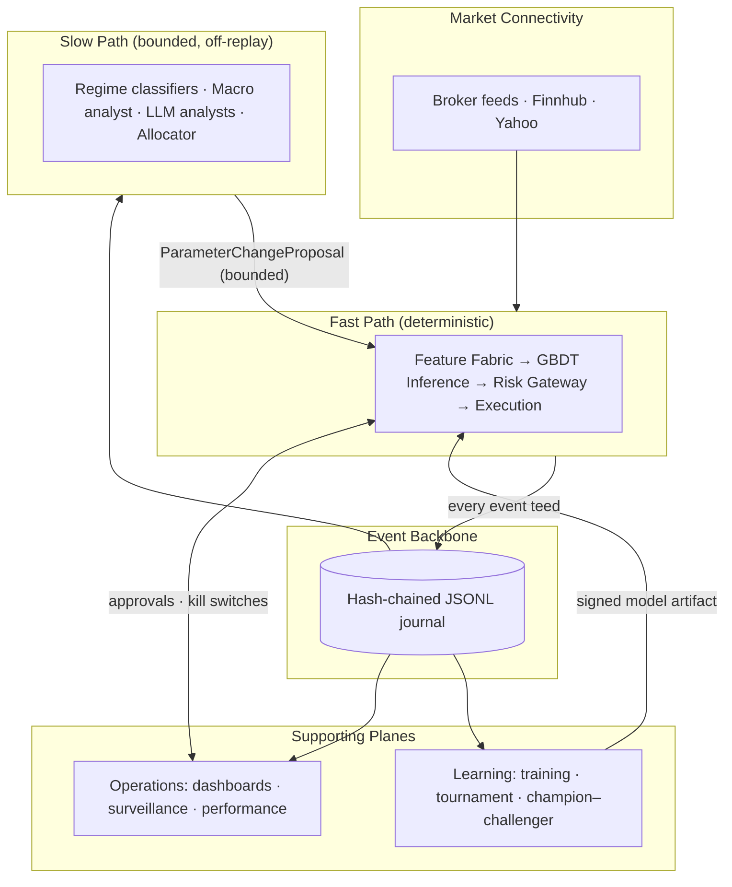
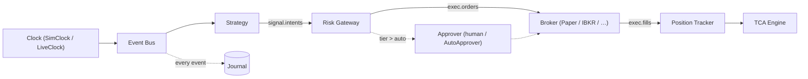
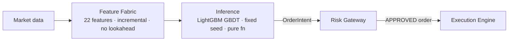
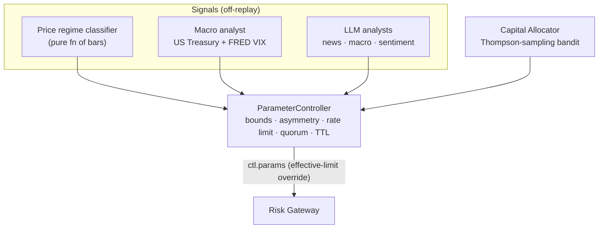
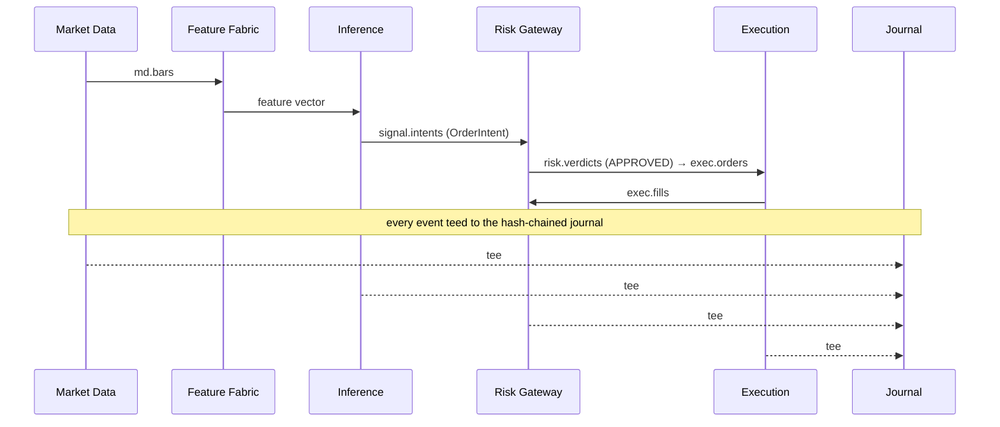
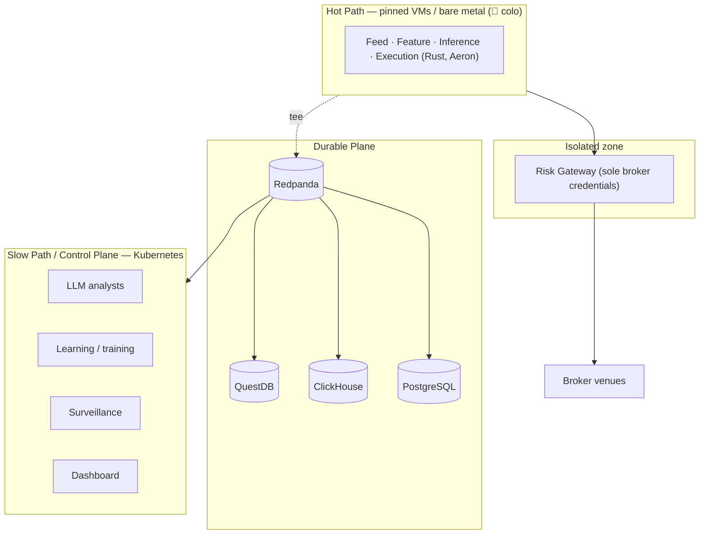
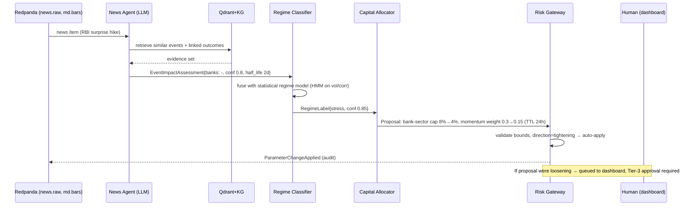
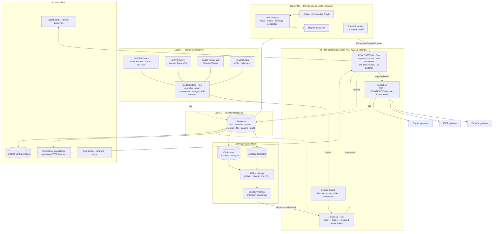

# Helios Capital — Enterprise AI Trading Platform: Architecture

**Status:** Canonical architecture document — the single source of truth for the platform.
**Audience:** Engineers (onboarding), Principal/Staff reviewers, Architecture Review Board, technical stakeholders.
**Last reviewed:** 2026-07.

This document describes both **what is built today** and **the target-state design it migrates toward**, and keeps the two strictly separated so a reader is never in doubt about what exists.

### Status legend

| Marker | Meaning |
|---|---|
| ✅ **Built** | In the codebase, wired, and tested today. |
| 🚧 **Planned** | On the roadmap with a defined migration phase; design settled, not yet implemented (or exists only as an optional, off-by-default adapter). |
| 🔮 **Future vision** | Directional north-star that depends on external prerequisites (e.g. exchange membership, colocation); not scheduled. |

> **Precedence rule:** where the *built* description (Parts 1–13) and the *roadmap/target* description (Part 14 onward and the appendices) disagree about what exists, the built description wins. The roadmap describes intent, not reality.

---

## Table of Contents

1. [Executive Summary](#1-executive-summary)
2. [System Overview](#2-system-overview)
3. [Core Principles](#3-core-principles)
4. [High-Level Architecture](#4-high-level-architecture)
5. [Runtime Architecture](#5-runtime-architecture)
6. [Component Architecture](#6-component-architecture)
   - 6.1 [Market Connectivity](#61-market-connectivity)
   - 6.2 [Trading Engine (Fast Path)](#62-trading-engine-fast-path)
   - 6.3 [Risk Gateway](#63-risk-gateway)
   - 6.4 [Execution Engine](#64-execution-engine)
   - 6.5 [AI Intelligence Layer (Slow Path)](#65-ai-intelligence-layer-slow-path)
   - 6.6 [Learning Layer](#66-learning-layer)
   - 6.7 [Operations Layer](#67-operations-layer)
7. [Event Flow](#7-event-flow)
8. [Storage Architecture](#8-storage-architecture)
9. [Security Architecture](#9-security-architecture)
10. [Deployment Architecture](#10-deployment-architecture)
11. [Technology Stack](#11-technology-stack)
12. [Current Build Status](#12-current-build-status)
13. [Running & Testing](#13-running--testing)
14. [Roadmap](#14-roadmap)
15. [Appendices](#15-appendices)

---

## 1. Executive Summary

Helios Capital is an AI-assisted trading platform for Indian and international markets. It is engineered around one architectural thesis: **separate the deterministic trade-decision path from the probabilistic intelligence path, and route every event through a replayable log so that backtest, shadow, and live trading are the same code path.**

Two faces sit over one backend:

- **An institutional, event-sourced trading pipeline** — deterministic, journaled, and replayable: `bars → strategy → risk gateway → broker → positions`. Every event is teed to a hash-chained JSONL journal.
- **A product REST surface and UIs** — a FastAPI recommendation / broker / learning / market-data API, a Next.js frontend, and a zero-dependency operator dashboard at `GET /dash`.

The design splits the platform into a **fast path** (feature computation → GBDT inference → risk gateway → execution — deterministic, explainable) and a **slow path** (news / macro / regime intelligence that may only adjust *bounded parameters* — risk limits, strategy weights, regime labels — never individual orders). Risk is a dedicated boundary, not an advisory peer: no order reaches a broker without passing it. Learning is offline-first — offline RL research plus contextual-bandit capital allocation with a shadow → canary → champion-challenger promotion pipeline — never direct online policy updates on live capital.

**Current status (✅ built).** Phases 0–5, Layer 6 dashboards, and public-API enrichment are implemented in Python + FastAPI + SQLAlchemy async over SQLite, with a hash-chained JSONL journal. CPU-only, free/OSS by mandate, ~281 tests.

**Honest constraint (stated up front).** True sub-millisecond tick-to-trade requires exchange membership, colocation, and native protocols (e.g. NSE TBT/NNF). Over a retail broker API (e.g. Zerodha), order placement costs 50–300 ms upstream and market data arrives as conflated snapshots; no internal architecture changes that. The design therefore targets (a) a sub-millisecond *internal* decision loop that is venue-agnostic, (b) graceful feature degradation by feed tier, and (c) a clean upgrade path to DMA/colocation without re-architecture. Strategy selection must match the latency tier actually available — intraday/swing alpha now, microstructure alpha only after direct market access.

---

## 2. System Overview

The platform is organized as **five planes across two speeds, unified by one log.**

| Plane | Responsibility |
|---|---|
| **Market Connectivity** | Per-venue/per-broker feed handlers normalize ticks, depth, trades, news, and macro into one internal event schema with dual timestamps (exchange + local receive). Order gateways are the mirror image outbound. |
| **Event Backbone** | The durable, replayable system-of-record. Every event (tick, feature snapshot, intent, verdict, order, ack, fill, parameter change, model version) lands on it. |
| **Feature & Decision (Fast Path)** | Incremental in-memory feature computation and deterministic model inference. Output is an *order intent*, never an order. |
| **Risk & Execution** | The risk gateway is the security boundary and sole order authority; behind it, the execution engine routes and measures fills. |
| **Intelligence (Slow Path)** | News/macro/regime analysis on a seconds-to-hours cadence whose only write interface is a bounded parameter proposal. |

**Two speeds.** The *fast path* makes trade decisions and must be deterministic and low-latency. The *slow path* adapts strategy on a human-scale cadence and is explicitly forbidden from touching orders.

**One log.** Every event is journaled. Because the fast path is a pure function of its event inputs, replaying the log through the same code reproduces the same decisions — **backtest/live parity is an architectural property, not a hope.**

---

## 3. Core Principles

These invariants are the contract the whole design rests on. They are stated once here; later sections reference them rather than restating them.

1. **LLMs are banned from the order path.** The fast path is a deterministic GBDT (LightGBM, fixed seed → byte-identical booster). LLMs live only in the slow path as bounded *parameter advisors*. *(Rationale: [Appendix A](#appendix-a--why-llms-never-sit-in-the-order-path).)*
2. **The risk gateway is the sole order boundary.** No order reaches a broker without an `APPROVED` `RiskVerdict`. Fail-closed.
3. **Determinism is a contract.** Same config + same bars → bit-identical intents, verdicts, orders, and fills. No wall-clock, RNG, or I/O inside the decision function.
4. **The slow path can never block or break the fast path.** Every slow-path callback is sandboxed; a crash is swallowed and counted; trading continues on last-known-good / TTL-decayed parameters.
5. **Slow-path writes are asymmetric.** Risk-*tightening* proposals auto-apply within bounds; risk-*loosening* proposals require human approval. A hallucinating analyst can only make the system *safer*, never more aggressive.
6. **Free/OSS only until profitable** (mandate). Paid services are opt-in, never default. The reference box is ~19.8 GB RAM, CPU-only.

---

## 4. High-Level Architecture

The system as built today. Each plane is drawn separately in [§6](#6-component-architecture); this is the single-glance overview.



Detailed, focused diagrams follow: [Runtime Flow](#5-runtime-architecture), [Fast Path](#62-trading-engine-fast-path), [Slow Path](#65-ai-intelligence-layer-slow-path), [Event Flow](#7-event-flow), and [Deployment](#10-deployment-architecture). The full target-state (Rust/Aeron/multi-venue) diagram is in [Appendix K](#appendix-k--target-state-reference-diagram).

---

## 5. Runtime Architecture

✅ **Built.** The session assembler `engine/runner.py::PaperSession` wires the pipeline in a fixed order and exposes two entry points that share identical configuration:

- `run()` — replays a bar stream once through the live pipeline.
- `replay_from_journal()` — rebuilds a bit-identical session from journaled bars alone.

Construction and subscription order are part of the determinism contract; component wiring in `engine/runner.py` must not be reordered.



**Event streams** (`core/events.py`): `md.bars`, `md.ticks`, `signal.intents`, `risk.verdicts`, `exec.orders`, `exec.order_updates`, `exec.fills`, `oms.positions`, `ctl.params`, `ctl.param_proposals`, `ctl.kill`, `ctl.approval_requests`, `ctl.approval_decisions`.

**Clocks are injected.** Timestamps are nanosecond UTC. Live trading injects `LiveClock`; replay/backtest injects `SimClock` advanced from event timestamps. Injecting the clock is what makes replay reproduce live decisions exactly.

---

## 6. Component Architecture

Each component is described once, authoritatively, here.

### 6.1 Market Connectivity

✅ **Built.** Per-symbol routing selects the best available source, with a documented fallback chain.

- **Indian brokers (live SDK):** Dhan, Upstox, Zerodha, with auto-routing.
- **Global:** IBKR adapter (Gateway/TWS, no API key).
- **Failover data tier:** Finnhub (keyed) for quotes/candles, inserted between the connected broker and the Yahoo fallback.
- **Fallback:** Yahoo Finance (15-min delayed for NSE/BSE).
- **Routing:** `pick_provider_for(symbol)` selects the source per symbol with a 30-second cache and data-plan probing. Quote routing order is **broker → Finnhub → Yahoo**; the `source` field on each quote reports which served it.
- **Symbology (✅ built):** OpenFIGI resolver (`services/openfigi_symbols.py`) maps a ticker to a broker-neutral FIGI id, removing cross-broker symbol skew. Keyless; an optional key raises the rate limit.

🚧 **Planned.** Dedicated Rust feed handlers with sequence-gap detection, A/B feed arbitration, and raw capture to the log; additional venues (IBKR FIX, crypto WS). See [Appendix C](#appendix-c--current-architecture-audit) item 4 for the motivation and [§14](#14-roadmap) for sequencing.

### 6.2 Trading Engine (Fast Path)

✅ **Built.** Every decision that results in an order flows through this deterministic pipeline.



- **Feature fabric** (`features/fabric.py`) — 22 features (13 technical indicators + 9 strategy-tournament votes), computed incrementally with no lookahead. The indicator code is shared with `learning/strategies.py`, giving zero train/live skew.
- **Inference** (`engine/inference.py`) — a pure function. LightGBM GBDT with a fixed seed produces a byte-identical booster. Models are versioned, signed artifacts (`learning/artifact.py`; `model_id = "model-" + sha[:12]`); the loader verifies the signature.
- **Determinism rule** — no wall-clock, RNG, or I/O inside the decision function. Inputs are the event and feature state only. *(Model-selection rationale: [Appendix B](#appendix-b--technology-rationale).)*

🚧 **Planned.** Port the feature fabric and inference to Rust over Aeron IPC; microstructure features (OBI, microprice, VPIN) once feed-tier data supports them.

### 6.3 Risk Gateway

The risk gateway is the platform's security boundary and **sole order authority** ([Principle 2](#3-core-principles)). It is described once here for both the built and target states.

✅ **Built** (`risk/gateway.py`, `risk/tiers.py`, `risk/limits.py`):

- **Pre-trade checks:** 9 synchronous checks; fail-closed.
- **Kill switches:** four escalation levels, K1–K4.
- **Working-order reservation (F1):** reserves the signed quantity of approved-but-unfilled orders so a burst cannot breach limits before fills land.
- **Parameter overrides:** consumes `ctl.params` as effective-limit overrides (the slow path's only lever — see [§6.5](#65-ai-intelligence-layer-slow-path)).
- **Determinism:** exposure sums iterate symbols in sorted order.
- **Autonomy tiers:** each intent is assigned Tier 1/2/3; the gateway releases only if `tier ≤ auto_release_max_tier`, otherwise it emits an `ApprovalRequest`. `AutoApprover` stands in for a human in headless runs. The `trusted` set is empty by default — nothing is autonomous until earned.

🚧 **Planned.** Re-implement as an isolated Rust process — own host/cores, own repo and deploy pipeline — that is the *only* holder of broker credentials, making it unbypassable by construction rather than convention. Target pre-trade budget < 50 µs; dual-instance hot standby with shared journal.

The full pre-trade control table, the asynchronous portfolio-risk controls, the kill-switch escalation table, and the dynamic autonomy-tier matrix are preserved in [Appendix F](#appendix-f--risk-controls-reference).

### 6.4 Execution Engine

✅ **Built** (`execution/`, `tca/`):

- **Smart Order Router (SOR):** health-scored broker selection with failover.
- **Execution algorithms:** IS / VWAP / POV / Adaptive slicing.
- **Pre-trade impact model:** Almgren-Chriss cost estimate.
- **Transaction Cost Analysis (TCA):** implementation-shortfall decomposition with markouts at +1 / +5 / +30 bars; results persisted to the TCA store.

🚧 **Planned.** Move TCA analytics to ClickHouse; expand markout horizons; deeper cross-broker SOR. The full implementation-shortfall math and credit-assignment rules are in [Appendix E](#appendix-e--rl--learning-deep-design).

### 6.5 AI Intelligence Layer (Slow Path)

Strategic adaptation on a seconds-to-hours cadence. **Power:** bounded parameter control. **Prohibition:** it can never emit, modify, or cancel an order ([Principle 1](#3-core-principles)). Everything here reaches the gateway through exactly one typed boundary.



✅ **Built:**

- **`ParameterController`** (`slowpath/params.py`) — the slow path's *only* write interface. Enforces bounds (min/max, max step), direction asymmetry (tighten auto-applies; loosen is held for human approval), rate limiting, quorum (≥ N independent sources), and TTL decay back to baseline.
- **Price regime classifier** (`slowpath/regime.py`) — a pure function of the bar stream (stays replay-deterministic); tightens on realized-volatility spikes.
- **Macro regime analyst + service** (`slowpath/macro_regime.py`, `engine/macro_regime_service.py`) — off-replay. Reads the US Treasury yield curve (no key) and FRED VIX (keyed), classifies `{None, stress, crisis}`, and emits tighten-only `risk.max_gross_exposure` proposals (stress → 60 %, crisis → 50 % of baseline; capped at one `max_step_frac` so a proposal applies from baseline in one poll, with deeper cuts ratcheting over successive polls). Hosted on a long-lived bus + `ParameterController` so proposals auto-apply and TTL-decay to baseline; opt-in, never auto-run. This is the statistical-plus-external-macro leg of the two-signal quorum. See [§6.5.1](#651-public-api-enrichment) and [`PUBLIC_API_ENRICHMENT.md`](./PUBLIC_API_ENRICHMENT.md).
- **LLM analysts** (`slowpath/analyst.py`, `personas.py`) — provider-agnostic (`slowpath/providers.py`: OpenAI, Anthropic, Gemini, Groq, Ollama, and any OpenAI-compatible endpoint). They read a news/macro item and emit an `EventImpactAssessment` mapped to a bounded proposal. Governed by `slowpath/governance.py` / `orchestrator.py` (lifecycle, budgets, rate limits, auto-pause).
- **Capital allocator** (`allocator/bandit.py`) — Thompson sampling over strategy + parameter arms; champion promotion via the [§7.4 gate](#appendix-e--rl--learning-deep-design). The offline-RL execution agent (`allocator/rl_execution.py`) runs shadow-mode only, never online on the live path.

Because of [Principle 4](#3-core-principles), if the entire slow path dies, trading continues under last-known-good / TTL-decayed parameters.

#### 6.5.1 Public-API enrichment

✅ **Built.** Three free public sources, confined to the slow path and product surface — off the fast path, order path, and replay. All are key-optional (a blank key disables the source and the app runs unchanged) and fail-closed to empty (any failure returns empty, never raises).

| Source | Key | Adapter | Role |
|---|---|---|---|
| **US Treasury** yield curve | none | `services/macro_data.py` | 10Y-2Y spread; inversion = stress precursor |
| **FRED** (Federal Reserve) | free | `services/macro_data.py` | VIXCLS implied vol + other series |
| **OpenFIGI** (Bloomberg symbology) | keyless (key raises rate limit) | `services/openfigi_symbols.py` | broker-neutral FIGI id — removes cross-broker symbol skew |
| **Finnhub** | free | `services/finnhub_provider.py` | market-data failover tier (broker → Finnhub → Yahoo) + news sentiment |

REST surface: `/api/v1/slowpath/macro`, `/api/v1/slowpath/symbology/{ticker}`, and the macro service `status` / `start` / `stop` / `poll` / `simulate`. Full detail in [`PUBLIC_API_ENRICHMENT.md`](./PUBLIC_API_ENRICHMENT.md).

🚧 **Planned.** Frontier LLM analysts with cited retrieval over Qdrant + a knowledge graph; additional paid data vendors as opt-in. The full slow-path agent roster, the `ParameterChangeProposal` schema, the orchestration sequence, and the retrieval design are in [Appendix D](#appendix-d--slow-path-target-design).

### 6.6 Learning Layer

✅ **Built.** Offline-first learning with safe deployment:

- **Strategy tournament** — walk-forward backtesting across 6+ strategies per symbol with purged CV, min-trade gates, and fee modeling; the live agent trades the winner (champion–challenger).
- **Contextual bandit** — Thompson sampling for capital allocation across strategies (see [§6.5](#65-ai-intelligence-layer-slow-path)).
- **Champion–challenger** — shadow → canary → promotion, gated by probabilistic Sharpe ratio.
- **Offline RL** — IQL/CQL research for execution tactics, shadow mode only.
- **Data pipeline** (`learning/`) — forward-return labels over a horizon (features read ≤ t, label reads t+H; no leakage); store-first bar fetch; signed model artifacts.

🚧 **Planned.** Offline-RL execution agent graduating from shadow through the promotion gate; training on QuestDB/ClickHouse-backed history. The online-learning risk analysis, the algorithm comparison, the reward function, the credit-assignment math, and the safe-learning pipeline are in [Appendix E](#appendix-e--rl--learning-deep-design).

### 6.7 Operations Layer

✅ **Built** (Layer 6):

- **Dashboards** — a zero-dependency vanilla-JS `/dash` operator UI plus the Next.js frontend, both read-side projections over the event journal (Trading, Risk, AI, TCA, Replay, Platform tabs), including incident replay that re-runs journaled bars and diffs the regenerated stream against the journal.
- **Surveillance** (`surveillance/detectors.py`) — wash / spoof / layering detectors.
- **Performance tracker** — hit rate, expectancy, and outcome grading at horizons.

🚧 **Planned.** Streaming surveillance jobs on Redpanda → ClickHouse; richer Tier-2/3 approval surfaces. The full detector set and compliance surveillance design are in [Appendix G](#appendix-g--compliance--surveillance).

---

## 7. Event Flow

✅ **Built.** Every event is content-hashed and chained (`hash(eventₙ)` includes `hash(eventₙ₋₁)`), making the journal tamper-evident and replay-deterministic (verified by `scripts/verify_audit_chain.py`). Because the fast path is a pure function of its inputs, replaying the log reproduces the identical stream.



**Runtime data-flow summary (product surface, ✅ built):**

```
Browser → Next.js (dashboard/brokers/training/performance/screener/monitor)
  → visibility-aware polling hooks → REST → FastAPI (app.main:app)
    → services/* → broker_adapters.* → market_data (Finnhub/Yahoo fallback)
    → SQLAlchemy → SQLite (broker_accounts, recommendations, trades, risk_limits)
    → hash-chained event journal (replay-deterministic)
  → JSON response → memoised, hash-dedup'd re-render
```

**Polling cadences (frontend):** health once on load; watchlist/intraday 20 s; recommendations/history/accounts/risk 60 s; performance 120 s; training status 2 s. All polls pause when the tab is hidden and abort in-flight requests before issuing new ones.

The full three-scenario walkthrough (tick → order, news → parameter change, fill → learning) with per-hop latency annotations is in [Appendix H](#appendix-h--data-flow-walkthrough).

---

## 8. Storage Architecture

✅ **Built (today).** Persistence is SQLAlchemy async over SQLite plus the JSONL journal.

| Store | Contents |
|---|---|
| SQLite `trading_bot.db` | OMS, trades, recommendations, broker accounts |
| SQLite `market_data.db` | durable OHLC bar store (store-first fetch, then network) |
| JSONL journal | hash-chained event log — the source of truth for replay |
| SQLite TCA store | TCA analytics sink |

**DB schema (SQLite):** `users`; `broker_accounts` (encrypted credentials + connection status + token expiry); `trade_recommendations` (with grading fields); `trades`; `risk_limits` (per-user gates + kill-switch state); `market_regimes`.

🚧 **Planned.** Adapters already exist behind opt-in dependencies and are off by default: **Redpanda** (durable replayable log), **QuestDB** (ticks/bars), **ClickHouse** (TCA/analytics/audit), **PostgreSQL** (OMS/reference), **Qdrant** (vectors, slow path only). SQLite is single-writer — heavy ingest and a live session contend — which is one motivation for the migration. Rationale for each engine is in [§11](#11-technology-stack).

---

## 9. Security Architecture

✅ **Built:**

- **Credentials at rest** — Fernet (AES-128-CBC + HMAC); raw keys are never returned in API responses (masked).
- **Order boundary** — the risk gateway is the sole path to a broker; the kill switch halts all trading in < 1 s.
- **Broker isolation** — the execution router never routes real orders to paper accounts.
- **Approval flow** — every order is preview → confirm; LIVE orders get a distinct confirmation.
- **Audit** — the hash-chained journal is tamper-evident and supports full trade reconstruction by deterministic replay.
- **Broker credential lifecycle** — token-based Indian brokers (Dhan, Zerodha, Upstox, AngelOne, ICICI Breeze) expire daily at 06:00 IST (SEBI); IBKR uses Gateway/TWS with no API key.

🚧 **Planned.** Broker credentials scoped *exclusively* to an isolated risk-gateway process (separate vault scope, separate account/VPC) with strategy-host egress to broker endpoints firewalled off; four-eyes approval on risk-limit raises; WORM audit archive with 7-year retention. The full compliance/jurisdiction design (SEBI, RBI, SEC/FINRA 15c3-5, MiFID II) and the surveillance detector set are in [Appendix G](#appendix-g--compliance--surveillance).

---

## 10. Deployment Architecture

✅ **Built (today).** A single-process FastAPI application (`app.main:app`) serves the REST API and the `/dash` dashboard; the Next.js frontend runs separately. SQLite files and the JSONL journal are local. One command (`start.ps1`) brings up the backend, dashboard, and (optionally) the legacy Next.js UI. Import root is `app.*` with `backend/` on `sys.path`.

🚧🔮 **Target deployment.** A single-host hot path on pinned CPU cores (`isolcpus`, NUMA-local memory, busy-poll sockets) with the risk gateway on its own hard-isolated host; a durable plane (Redpanda ×3, QuestDB primary+replica, ClickHouse, Postgres HA, WORM object storage); and a slow path / control plane on managed Kubernetes. Clocks are PTP-disciplined (UTC ns). Environments progress `research → paper → prod`, where **paper is a permanent, always-on environment** in which every change soaks.



The full deployment blueprint (host topology, standby, fencing, secrets, clock discipline) is in [Appendix I](#appendix-i--target-deployment-blueprint).

---

## 11. Technology Stack

The current stack is Python/FastAPI/SQLite (✅ built). The table below is the **target** technology matrix; the Status column maps each choice to its build state. Full "why chosen / alternatives / trade-offs" reasoning is preserved verbatim for each row.

| Component | Technology | Status | Why chosen | Alternatives | Trade-offs |
|---|---|---|---|---|---|
| Feed handlers, feature fabric, inference, risk gateway, exec engine | **Rust** | 🚧 (Python today) | memory-safe + no GC pauses; µs-predictable; one language across hot path | C++ (faster to hire vets, footguns), Go (GC pauses 0.5–10 ms), Java+Chronicle (JVM tuning tax) | smaller talent pool; slower iteration than Python — mitigated by keeping research in Python |
| Research, training, slow-path services, backtest authoring | **Python** (Polars, LightGBM, PyTorch) | ✅ | ecosystem; speed of iteration | Julia (ecosystem risk) | never in the order path after Phase 3 |
| Control-plane services (dashboard API, approvals) | Python FastAPI now; Go if team grows | ✅ | already started; latency-insensitive | Go, TS/Node | fine as-is |
| Hot-path messaging | **Aeron** | 🚧 (in-process `MemoryBus` today) | shared-memory IPC, single-digit µs, battle-tested in trading | Chronicle Queue (JVM-centric — we have no JVM), raw shared-memory rings (NIH), iceoryx2 | operational learning curve; worth it only on the single-host hot path |
| Durable event bus | **Redpanda** | 🚧 (JSONL journal today; adapter exists) | Kafka API without ZooKeeper/JVM; single binary; p99 publish ~5–15 ms at our scale; strong replay | Kafka (heavier ops, same API), NATS JetStream (weaker ecosystem for replay tooling), Pulsar (operational overkill) | smaller community than Kafka; acceptable |
| Tick/bar store | **QuestDB** | 🚧 (SQLite `market_data.db` today) | millions rows/s ingest; SQL; designed for ticks; replaces SQLite `market_data.db` | TimescaleDB (richer SQL, ~10× slower ingest), kdb+ (cost), Arctic/Parquet (no live query) | younger ecosystem; mitigated by Redpanda being the true system of record |
| Analytics / TCA / audit queries | **ClickHouse** | 🚧 (SQLite TCA store today) | columnar scans over billions of events in seconds; cheap retention | BigQuery/Snowflake (egress + latency + cloud lock-in), DuckDB (single-node only — fine for research) | ops effort for cluster; start single-node |
| OMS / positions / reference data | **PostgreSQL** | 🚧 (SQLite today) | correctness, FKs, transactions; boring is good here | — | not for ticks, ever |
| Hot state / session cache | **Redis** (Dragonfly if/when throughput demands) | 🚧 (in-process today) | ubiquitous; sub-ms | Dragonfly (faster, multi-threaded; younger), KeyDB | hot-path state actually lives in-process; Redis is for the control plane/dashboard |
| Feature store (training-serving parity) | **Feast** (offline registry) + in-process fabric (online) | 🚧 (in-process fabric ✅; registry planned) | declarative parity between training data and live computation | Tecton (cost), homegrown registry | Feast's online store is too slow for µs serving — use it for *definitions/training*, serve from the in-process fabric |
| Vector DB | **Qdrant** | 🔴 not built | HA, filtering, perf; replaces Chroma | pgvector (simpler, fine at small scale — acceptable interim), Weaviate, Milvus | one more service; slow path only |
| LLMs (slow path) | Frontier API models (function-calling, structured output) | ✅ (provider-agnostic) | best reasoning per ₹; structured `Proposal` outputs | self-hosted Llama-class (data control vs quality gap) | API dependency tolerable — slow path is not availability-critical |
| Macro / enrichment data (slow path) | **US Treasury** (yield curve, no key) + **FRED** (VIX) + **OpenFIGI** (symbology) + **Finnhub** (quotes/news) over httpx | ✅ | free tiers; no extra deps; realizes the macro/regime + symbology needs today | OpenBB SDK (heavier), paid vendors (Bloomberg/Refinitiv) | key-optional, fail-closed to empty; off the fast path — an outage changes nothing |
| Orchestration (slow path + control plane) | **Kubernetes** (managed) | 🚧 (single-process today) | standard ops, autoscaling for analysts/training | Nomad (simpler, smaller ecosystem) | **never** for the hot path |
| Hot-path hosts | **Pinned VMs / bare metal**, ap-south-1 (Mumbai) now; exchange colo at DMA stage | 🔮 | K8s scheduling/CNI jitter is poison for µs paths; CPU pinning, NUMA locality, busy-polling | K8s with static CPU manager (still net jitter) | manual ops for 2–3 boxes — acceptable |
| IaC / deploy | Terraform + GitOps (Argo) for K8s; Ansible for hot hosts | 🚧 | reproducibility; auditable change history | — | — |
| Secrets | Vault (or cloud KMS+SM) | 🚧 | broker creds scoping to risk gateway only | — | — |
| Observability | Prometheus + Grafana + Loki/ClickHouse logs + OpenTelemetry traces | 🚧 | standard; histogram-native (µs buckets via HDR histograms) | Datadog (cost at tick volume) | self-host effort |

---

## 12. Current Build Status

The authoritative built-vs-planned map. Legend: ✅ built · 🟡 partial / adapter exists behind an opt-in dependency · 🔴 not built.

| Concern | Built today | Target-state | Status |
|---|---|---|---|
| Fast-path language | Python (deterministic, pure fn) | Rust | 🟡 planned |
| Decision model | LightGBM GBDT, byte-identical | same | ✅ built |
| Risk gateway | Python module, fail-closed | Rust, sole credential holder | ✅ built (Python) |
| Hot-path messaging | in-process `MemoryBus` | Aeron (µs IPC) | 🟡 planned |
| Durable event bus | JSONL journal (+ optional Redpanda adapter) | Redpanda | ✅ journal / 🟡 Redpanda |
| Tick/bar store | SQLite `market_data.db` | QuestDB | ✅ SQLite / 🟡 QuestDB |
| TCA/audit analytics | SQLite TCA store | ClickHouse | ✅ SQLite / 🟡 ClickHouse |
| OMS / positions | SQLite | PostgreSQL | ✅ SQLite / 🟡 Postgres |
| Vector memory | — | Qdrant + knowledge graph | 🔴 not built |
| Slow-path LLMs | provider-agnostic, bounded proposals | frontier models + citations | ✅ built |
| Macro/enrichment data | Treasury/FRED/OpenFIGI/Finnhub | + paid vendors | ✅ built |
| Orchestration | single-process FastAPI + asyncio | Kubernetes (slow path only) | 🟡 planned |
| Dashboards | `/dash` (zero-dep) + Next.js | same + richer approvals | ✅ built |

**Phase completion.** Phases 0–5 and Layer 6 are complete, plus public-API enrichment:

| Phase | Theme | Status |
|---|---|---|
| 0 | Deterministic journaled paper pipeline; audit chain; risk boundary | ✅ |
| 1 | Deterministic GBDT fast path; F1 working-order reservation | ✅ |
| 2 | TCA (implementation shortfall + markouts); autonomy tiers | ✅ |
| 3 | Slow path: bounded parameter control, regime, LLM analyst | ✅ |
| 4 | Multi-broker execution + surveillance | ✅ |
| 5 | Learning & speed: bandit allocator, promotion gate, offline-RL shadow, profiler, DMA economics | ✅ |
| 6 | Read-side dashboards (journal projections) | ✅ |
| — | Public-API enrichment (macro regime, symbology, data failover) | ✅ |

---

## 13. Running & Testing

```powershell
# One command: backend + dashboard (+ legacy Next.js UI if configured)
.\start.ps1                       # opens http://127.0.0.1:8000/dash

# Backend only (preferred invocation — app.* import root)
venv\Scripts\python.exe -m uvicorn app.main:app --app-dir backend --port 8000

# Full test suite (~281 tests, tests/ dir)
venv\Scripts\python.exe -m pytest
```

- Dashboard UI: `http://127.0.0.1:8000/dash` · API docs: `/docs` · health: `/health`.
- Import root is `app.*` with `backend/` on `sys.path` (matches the test suite).
- Key invariant tests: `test_order_boundary.py` (no order without approval), `test_e2e_paper.py` / `test_e2e_model.py` (replay parity), `test_audit_chain.py` (journal hash chain), `test_slowpath.py` (chaos isolation), `test_risk_working_orders.py` (F1 reservation).

**Related documents:** phase build records `PHASE0_REVIEW.md`–`PHASE5_IMPLEMENTATION.md`, `LAYER6_DASHBOARDS.md`; enrichment `PUBLIC_API_ENRICHMENT.md`; REST reference `API.md`; end-user manual `USER_GUIDE.md`.

---

## 14. Roadmap

Sequenced for **risk reduction first, speed last** — at retail-broker latency, correctness/risk/measurement pay off immediately while microseconds do not. Phases 0–5 are complete (✅); the table records their build scope and exit criteria and the remaining Rust/Aeron/DMA work (🚧🔮).

| Phase | Weeks | Build | Exit criteria |
|---|---|---|---|
| **0 — Truth & Safety foundations** | 1–4 | Event schema + Redpanda (single node OK); every component publishes; ns timestamps; WORM audit chain; paper-trading env; port `market_data.db` (SQLite) → QuestDB; keep existing Python | every action reconstructable from log; paper env runs a full market day unattended |
| **1 — Deterministic decisions + real risk** | 5–10 | Replace LLM-in-loop decisioning with GBDT fast path **in Python**; **Rust risk gateway v1** (position/exposure/fat-finger/rate/margin/STP, K1–K4); all orders through it; broker creds moved to gateway scope | 100 % of orders gated; internal p99 < 10 ms; zero ungated order path exists (verified by network-policy test) |
| **2 — Measurement & parity** | 11–16 | TCA pipeline (IS decomposition, markouts) in ClickHouse; fill simulator; backtest = replay of log through live code path; autonomy tiers v1 (start: everything Tier 2/3, earn Tier 1) | replay-determinism test green nightly; TCA on every fill; first Tier-1 enablement gated on 4 clean weeks |
| **3 — Slow path & feeds** | 17–24 | LLM analyst agents + Qdrant/KG + regime classifier emitting bounded `ParameterChangeProposal`s; second feed source; feed-tier-aware feature fabric | slow-path outage provably harmless (chaos test); tightening proposals auto-apply, loosening requires approval |
| **4 — Multi-broker & execution** | 25–32 | IBKR integration; SOR v1; execution algos (IS/POV/adaptive); cross-broker reconciliation; surveillance detectors live | execution slippage ≤ impact-model baseline; failover broker drill passed |
| **5 — Learning & speed** | 33+ | Bandit capital allocator; offline-RL execution research in shadow; port feature/inference hot path to Rust + Aeron; evaluate DMA/colo economics | challenger promotions only via the [§7.4 gate](#appendix-e--rl--learning-deep-design); internal p99 < 1 ms; DMA go/no-go memo with measured alpha-vs-latency sensitivity |

**What gets deleted** on the way to target: LLM agents as trade deciders; ChromaDB (→ Qdrant/pgvector, slow path); per-trade human approval as the only control (→ tiers); direct broker calls from strategy code (→ gateway-only, enforced by network).

**What gets kept:** the strategy-tournament concept (it *is* champion–challenger); the durable bar-store idea (store-first fetch survives, engine upgrades to QuestDB); the dashboard approval flow (becomes the Tier-2/3 surface); Postgres for OMS; the explainability ethos (enforced via logged attributions).

**Honest latency caveat (restated).** Zerodha retail tier = 50–300 ms venue latency + conflated snapshots; any sub-ms figures in this document are internal-pipeline only until DMA/colocation.

> **Open questions for the next design cycle:** target capital range and instrument scope for Phase-1 paper trading; the broker for the second venue (IBKR vs Dhan/Fyers as NSE backup); whether F&O enters before or after Phase 4 (margin/SPAN logic is the long pole).

---

## 15. Appendices

The appendices carry the deep design rationale, quantitative analysis, and target-state specifications. They are reference material — nothing here contradicts Parts 1–14; where a topic is built today, that fact is noted at its first appearance in the main body.

### Appendix A — Why LLMs never sit in the order path

An LLM is an excellent *analyst* and a terrible *executor*. It writes to parameters, slowly and boundedly; it never writes to orders. The reasons:

1. **Latency:** LLM p50 is 1–10 s, p99 worse; intraday alpha half-life is often seconds. The trade is dead before the token stream ends.
2. **Non-determinism:** identical market state can produce different orders — unacceptable for risk control, for regulators (MiFID II RTS 6 requires reproducible algo behavior; SEBI requires registered, identifiable strategy behavior), and for debugging.
3. **Non-replayability:** you cannot re-run yesterday's incident if the decision function is a sampled distribution behind a third-party API.
4. **Hallucination under distribution shift:** precisely during black swans — inputs the model has never seen — an LLM's failure mode is *confident fabrication*, the worst property at the worst time.
5. **Availability coupling:** an external API outage becomes a trading outage.
6. **Cost scaling:** token cost × decisions/day is a tax on every trade; GBDT inference is effectively free.

### Appendix B — Technology rationale

**Why GBDT for the decision model.** LightGBM/XGBoost classifiers/regressors per strategy predict P(favorable move over horizon h) and expected-return quantiles. Chosen over deep nets for: tabular dominance; monotonic constraints (e.g. "wider spread never increases buy aggression"); native feature attribution (per-decision SHAP-style logging satisfies the explainability requirement); and microsecond inference. A lightweight online layer (online logistic regression / EWMA recalibration, Platt-style) sits on top of GBDT scores, updated intraday under strict learning-rate caps — it adapts *calibration, not structure*. Models are versioned, signed artifacts; the inference service memory-maps the model and hot-swaps by atomic pointer switch; every decision logs `(model_id, feature_vector_hash, score, top_attributions)`.

**Why Rust for the hot path.** Memory safety without a GC (no GC pause in the order path — Java/Go can stall 1–10 ms at the worst moment), fearless concurrency for lock-free limit tables, `#![forbid(unsafe_code)]` in the checking core, exhaustive `match` on order states (compiler-enforced completeness), and a small attack surface.

**Why event sourcing.** A durable, replayable log makes backtest, shadow, and live trading the same code path — parity is an architectural property. It also yields a tamper-evident audit trail and answers "what happened at 09:47:13?" precisely.

**Why offline RL.** See [Appendix E](#appendix-e--rl--learning-deep-design).

### Appendix C — Current Architecture Audit

This audit is of the *original* multi-agent-LLM design (the starting point), retained as design motivation. Severity: 10 = capital-destroying / disqualifying for institutional use. Of the described original system, roughly 5 % existed in code — meaning there was effectively no legacy to migrate, and the platform could be built correctly from first principles.

| # | Subsystem | Bottleneck | Root Cause | Impact | Sev | Recommended Fix |
|---|-----------|------------|------------|--------|-----|-----------------|
| 1 | **Decision path (Multi-Agent LLM)** | Serial LLM round-trips (Technical→News→Macro→Risk→Capital→Decision) cost 5–30 s per recommendation; outputs non-deterministic | LLMs placed in the trade-decision critical path | Alpha decays before order exists; identical inputs → different trades; impossible to replay/audit; per-decision token cost scales with trade count | **10** | Split fast/slow path. Trade decisions: deterministic GBDT/online models in Rust (<100 µs). LLMs demoted to slow-path parameter advisors |
| 2 | **Risk management ("Risk Agent")** | Risk is a peer agent in the same process/prompt chain as alpha agents | Risk modeled as advice, not as a boundary | Any orchestrator bug, prompt drift, or agent failure bypasses risk; one bad loop can send unlimited orders | **10** | Standalone Rust risk gateway; sole holder of broker credentials; every order passes pre-trade checks in-process; kill switches |
| 3 | **RL loop (online weight updates from PnL + user feedback)** | Continuous online updates on non-stationary, sparse, delayed reward | No off-policy evaluation, no shadow stage, reward = raw PnL | Catastrophic forgetting on regime change; feedback loops (model trades → moves its own reward); reward hacking; user feedback poisons policy | **9** | Offline RL (IQL/CQL) + contextual bandit allocation; shadow → canary → champion/challenger; risk-adjusted reward with turnover penalty |
| 4 | **Market data ingestion** | Single broker WebSocket (Kite) into Python asyncio; conflated snapshots ~1/sec, 3k-instrument cap per connection; no sequencing, no raw capture | Broker SDK treated as a market-data platform | Gaps undetected; no replay → no backtest parity; GC pauses stall the only feed; microstructure features impossible from snapshot data | **9** | Dedicated feed handlers (Rust) with normalization, sequence-gap detection, A/B feed arbitration, raw capture; feed-tier-aware feature fabric |
| 5 | **Approval workflow (human approves every trade)** | Human latency: minutes-to-never | "Mandatory human approval" as the only safety mechanism | Intraday alpha gone before approval; approval fatigue → rubber-stamping; blocks scaling to multi-strategy | **8** | Dynamic autonomy tiers (Tier 1 auto within hard limits / Tier 2 timeout-approval / Tier 3 human-required) |
| 6 | **Execution** | Direct market/limit orders via broker REST; no SOR, no execution algos, no TCA, no slippage model | Execution treated as an API call, not a discipline | Pays full spread + impact; no measurement → no improvement; single broker = single point of failure | **8** | Execution stack: pre-trade impact model, algo suite (IS/VWAP/POV/adaptive), multi-broker SOR, post-trade TCA in ClickHouse |
| 7 | **Storage** | Postgres for everything transactional; ChromaDB (embedded, single-node) for "market regimes"; SQLite bar store; Redis as price cache | No separation of tick store / analytics / OMS state | Postgres can't ingest tick volumes; Chroma has no HA/SLA and similarity ≠ causality for regimes; no time-series engine → no fast TCA/backtests | **7** | QuestDB (ticks/bars), ClickHouse (TCA/analytics/audit queries), Postgres (OMS/reference only), Qdrant (vectors, slow path only), Redis/Dragonfly (hot state) |
| 8 | **Event transport** | None — components call each other directly (function calls / REST) | No event backbone | No replay, no audit trail, no decoupling; any consumer failure back-pressures the producer; "what happened at 09:47:13?" is unanswerable | **9** | Aeron (hot path IPC) + Redpanda (durable log, replay, slow path) |
| 9 | **Compliance** | Entirely absent | Not designed for | SEBI algo-trading framework non-compliance; no surveillance (spoofing/wash/OTR); regulatory and broker-termination risk | **9** | Dedicated compliance layer: pre-trade rule enforcement in risk gateway, post-trade surveillance jobs, WORM audit log, 7-year retention |
| 10 | **Observability / DR** | No metrics, no tracing, no audit log, no failover; Windows dev box is the deployment target | Prototype posture | Silent failures during market hours; no trade reconstruction; broker/exchange outage = undefined behavior | **9** | Prometheus/Grafana + order-lifecycle tracing + WORM audit; documented DR with RTO/RPO per component |
| 11 | **RAG (ChromaDB historical event context)** | Vector similarity over news embeddings used as decision context | Embedding similarity conflated with causal relevance | "Similar" past events with opposite outcomes retrieved confidently; embedded DB in decision path adds 50–500 ms | **7** | Move to slow path only; Qdrant + knowledge graph with typed event→outcome edges; LLM analyst consumes it, fast path never does |
| 12 | **Implementation reality** | Described system ≈ docs; code = 4 stubs | Early stage | Audit is of the *design*; nothing is sunk cost | — | Treat as greenfield. Build target state directly |

**Stress-event behavior of the original design:** during a flash crash, LLM agents would reason about stale snapshots with multi-second latency; the Risk "Agent" could be skipped by an orchestrator exception; Redis would serve stale prices; the human approver becomes the bottleneck exactly when seconds matter; and there is no cancel-on-disconnect, no kill switch, and no de-risk ladder. The original design's stress behavior was **undefined**, which for a trading system means **capital-destroying** — the core motivation for the redesign.

### Appendix D — Slow-path target design

The [§6.5](#65-ai-intelligence-layer-slow-path) built slow path realizes, in concrete adapters, the following target design.

**Target agent roster (frontier LLMs):**

| Agent | Inputs | Output (typed, bounded) |
|---|---|---|
| News intelligence | news stream, filings, Qdrant retrieval | `EventImpactAssessment{symbols, direction, confidence, half_life}` |
| Macro analyst | RBI/Fed calendars, prints vs consensus | `MacroStateUpdate{rates_outlook, liquidity_state}` |
| Earnings interpreter | transcripts, results vs estimates | per-symbol drift/vol expectations |
| Geopolitical monitor | curated feeds | `TailRiskAlert{severity, affected_sectors}` |
| Regime classifier | all above + realized vol/corr/breadth from fast path | `RegimeLabel ∈ {trend, chop, stress, crisis}` + confidence |

**Supporting memory (🔴 not built):** Qdrant for embeddings plus a knowledge graph (typed edges: event →[preceded]→ outcome, company →[supplier_of]→ company) so retrieval is causal-ish, not just cosine-similar. LLM analysts must cite retrieved evidence IDs; the citation list is stored with the proposal for auditability.

**The only write interface — `ParameterChangeProposal`:**

```json
{
  "proposal_id": "uuid",
  "source_agent": "regime_classifier",
  "parameter": "strategy_weight.momentum_v3",
  "current": 0.30, "proposed": 0.15,
  "ttl": "4h",
  "evidence": ["news:8821", "kg:edge:4410", "vol:realized_5m=4.2sigma"],
  "rationale": "regime shift trend→stress; momentum alpha decays in stress"
}
```

Enforcement (in the risk gateway / `ParameterController`, not in the agent): **bounds** (min/max, max step per change, max change frequency); **direction asymmetry** (tightening auto-applies; loosening queues for human approval); **TTL** (every change expires back to baseline unless renewed); **rate limit + quorum** (large regime changes require ≥ 2 independent signals — LLM assessment plus statistical regime model — before capital allocation shifts).

**Orchestration (target):**



### Appendix E — RL & Learning deep design

**Online-learning risks → mitigations:**

| Risk | Mechanism in the original design | Mitigation in target |
|---|---|---|
| Catastrophic forgetting | continuous weight updates on recent PnL | no live weight updates; training offline on full history with regime-stratified sampling; new models are *new versions*, old champion retained and restorable |
| Feedback loops | model's own trades move price → reward reflects own impact | train on counterfactual mid-price markouts, not raw fill PnL; cap participation (POV ≤ limits); impact model subtracts estimated own-impact from reward |
| Reward hacking | raw PnL reward | risk-adjusted reward with explicit penalties; reward components logged and audited; hard action-space constraints enforced by the risk gateway, not by reward |
| Overfitting | unconstrained continuous fit | walk-forward + purged k-fold CV (embargoed, López de Prado); deflated Sharpe ratio for selection; min-sample gates before promotion |
| Human-feedback poisoning | user feedback directly updates weights | feedback only labels data for offline review; never a gradient signal |

**Reward function (per strategy, per period):** `r_t = ΔNAV_t − λ·σ̂_t(ΔNAV) − κ·Turnover_t − c·Costs_t − β·DD_t`, with λ calibrated so the optimum approximates max-Sharpe, κ penalizing churn, and DD_t the incremental drawdown. All coefficients are versioned; changing the reward is a new experiment, never silent.

**Algorithm comparison and recommendation:**

| Algorithm | Fit for trading | Verdict |
|---|---|---|
| DQN | discrete actions; overestimation bias; brittle under non-stationarity | No — fragile exactly where markets are hard |
| PPO | on-policy → needs fresh interaction data; live interaction = live risk | Only inside simulators; never online on capital |
| A2C/A3C | weaker PPO | No |
| SAC | off-policy, continuous actions, entropy regularization | Best online-family candidate for sizing — but only in sim/shadow |
| **Offline RL (IQL/CQL)** | learns from logged data without live exploration; conservatism penalizes out-of-distribution actions | **Yes — primary.** CQL adds `α·E_s[log Σ_a e^{Q(s,a)} − E_{a∼μ}Q(s,a)]` to the TD loss, pushing down Q for unseen actions |
| **Contextual bandit (Thompson sampling)** | no trajectory credit-assignment problem; allocates capital across strategies given regime context | **Yes — the production allocator** |

**Production architecture (three layers, decreasing autonomy):** (1) **Signal layer** — supervised GBDT predicts returns/probabilities; most of the edge lives here. (2) **Allocation layer** — contextual bandit over strategies: context = regime label + realized vol + recent strategy Sharpe; action = bounded-simplex capital weights; reward = next-period risk-adjusted strategy return; Thompson sampling with conservative priors. (3) **Policy layer (research)** — offline RL (IQL) on logged `(state, action, markout)` for execution tactics; ships only through the safe-learning pipeline.

**Credit assignment — Implementation shortfall (Perold) decomposition.** With p_d = decision price, p_a = arrival price, p̄_f = average fill, q* = intended qty, q = filled qty, p_T = mid at horizon T:

```
IS = (p̄_f − p_d)·q + (p_T − p_d)·(q* − q)
   = Delay cost      (p_a − p_d)·q          ← latency: broker, network, human approval
   + Execution cost  (p̄_f − p_a)·q          ← spread + market impact
   + Opportunity cost (p_T − p_d)·(q* − q)   ← unfilled quantity
```

Attribution rules: **bad signal** — markout `α_h = E[mid_{t_d+h} − mid_{t_d}] · side` over h ∈ {1s, 10s, 1m, 5m, 30m}, measured against mid (immune to spread noise); **broker/venue latency** — `(p_a − p_d)` split across logged ns timestamps `t_signal → t_intent → t_risk_ok → t_sent → t_broker_ack → t_exchange_ack`; **human delay (Tier 2/3)** — delay sub-term over `[t_notified, t_approved]`, reported per user (approval cost visible in rupees); **slippage vs noise** — microprice/mid for all marks; impact tested against the square-root baseline `ΔP ≈ Y·σ·√(Q/ADV)`.

**Safe learning pipeline:**

```
offline train → offline eval (OPE) → shadow (live data, paper fills) → canary (5% capital) → champion
```

1. **Offline evaluation:** walk-forward, purged/embargoed CV; deflated Sharpe; doubly-robust off-policy estimate `V̂_DR(π) = (1/n) Σᵢ [V̂(sᵢ) + ρᵢ·(rᵢ − Q̂(sᵢ,aᵢ))]`, `ρᵢ = π(aᵢ|sᵢ)/μ(aᵢ|sᵢ)`, importance weights clipped.
2. **Shadow:** challenger consumes the live event stream into a fill simulator (queue-position + impact model on captured book states). Runs ≥ 4 weeks or ≥ 200 trades, whichever is later.
3. **Canary:** 5 % of strategy capital, same risk limits scaled down. Auto-rollback on drawdown > 2× champion's, slippage > model + 50 %, or any hard-limit hit.
4. **Champion–challenger promotion gate (§7.4):** probabilistic Sharpe ratio PSR(challenger > champion) ≥ 0.95 on the overlapping live period; max-DD within mandate; TCA not worse. Promotion = config change + audit event; the old champion is kept warm for instant rollback.
5. **Counterfactual testing:** weekly replay of the full event log through both models; divergence report reviewed before any promotion.

### Appendix F — Risk controls reference

**Pre-trade controls (synchronous, target < 50 µs):**

| Control | Check | Typical default |
|---|---|---|
| Position limits | per-symbol net/gross qty and notional post-order | per-symbol ≤ 2 % NAV |
| Exposure limits | gross/net portfolio, per-sector, per-strategy notional | gross ≤ 150 % NAV, sector ≤ 15 % |
| Fat-finger | order size vs ADV and vs 30-day avg order; price collar vs LTP | size ≤ 1 % ADV; price within ±3 % of LTP |
| Rate limits | orders/sec per strategy, OTR (order-to-trade ratio) | throttle well below NSE OTR penalty onset |
| Margin | SPAN+exposure margin pre-check vs available | ≥ 25 % buffer maintained |
| Liquidity | order ≤ x % of visible depth within 5 bps; reject in illiquid names | ≤ 20 % of top-3-level depth |
| Self-trade prevention | would-cross against own resting order → cancel-newest | always on |

**Asynchronous portfolio controls (100 ms–1 s cadence):** parametric + historical VaR (95/99) with CVaR limit; factor/beta exposure caps; pairwise-correlation concentration; drawdown ladders (−2 % day → halve all new sizes; −4 % → Tier 1 suspended; −6 % → flatten ladder + human page). Breaches are *enforced* by flipping pre-trade limit tables, keeping the sync path microsecond-fast.

**Kill switches (escalation levels):**

| Level | Action | Trigger / who |
|---|---|---|
| K1 | halt one strategy (no new intents) | auto: strategy DD/slippage anomaly; or one click |
| K2 | cancel all resting orders, block new entries platform-wide | auto: feed-integrity failure, position mismatch broker-vs-internal; or risk officer |
| K3 | de-risk ladder: reduce positions passively → aggressively to flat | auto: black-swan triggers; or risk officer |
| K4 | drop broker sessions (cancel-on-disconnect engaged), platform dark | big red button (physical/dashboard); auto on risk-gateway self-check failure |

K4 must work when everything else is down: a tiny independent watchdog process + broker-side cancel-on-disconnect, tested monthly in paper.

**Dynamic autonomy tiers:**

| Tier | Mode | Conditions (ALL must hold) |
|---|---|---|
| **1 — Fully autonomous** | execute immediately | liquid instrument (top-N ADV); order ≤ 0.25 % NAV and ≤ 0.5 % ADV; all limits ≥ 30 % headroom; regime ∈ {trend, chop}; model confidence ≥ threshold; strategy is champion |
| **2 — Conditional** | notify human; auto-execute after timeout (e.g. 90 s) unless vetoed; size auto-reduced 50 % on timeout-execute | any: order ≤ 1 % NAV; limit headroom 10–30 %; regime = stress; earnings/event window; canary strategy |
| **3 — Human required** | no execution without explicit approval; expires worthless after TTL | any: new strategy first 2 weeks; order > 1 % NAV; illiquid instrument; regime = crisis; post-K-switch resumption; any risk-loosening proposal; manual override of a risk verdict (four-eyes) |

Escalation: tier is a deterministic function of the table, computed per-intent; any failing condition pushes the intent down a tier; ≥ 3 consecutive Tier-2 vetoes in a session auto-suspend the strategy to Tier 3. De-escalation (crisis → normal) requires both the statistical regime model and human confirmation — asymmetric on purpose.

### Appendix G — Compliance & surveillance

Dedicated layer, two halves: **pre-trade enforcement** (inside the risk gateway, synchronous) and **post-trade surveillance** (streaming jobs on Redpanda → ClickHouse).

**Jurisdiction mapping (design targets):**

| Regime | Key obligations engineered for |
|---|---|
| SEBI (primary) | algo strategy registration/approval via broker & exchange; every order tagged with registered algo/strategy ID; broker-level kill switch honored; audit-trail retention (≥ 5 y; we keep 7); OTR limits; SOR is broker/exchange only in India |
| RBI | relevant if FX/cross-border capital (LRS limits; crypto via FIU-registered exchanges, PMLA/KYC) |
| SEC/FINRA (via IBKR, US sleeve) | Rule 15c3-5 Market Access: pre-trade risk controls are a legal requirement — the risk gateway is the documented control; CAT-compatible event records |
| MiFID II (if EU later) | RTS 6: algo testing, kill functionality, annual self-assessment; RTS 25 clock sync (UTC-traceable, ≤ 100 µs) — the PTP/ns-timestamp design already conforms |

**Real-time enforcement (pre-trade):** self-trade prevention; price collars; restricted/halted-instrument list; position-limit regs (e.g. F&O market-wide limits); order-rate and OTR throttles; mandatory strategy-ID tag on every order (reject untagged).

**Surveillance detectors (post-trade, streaming; each emits a scored alert, K1-capable on high score):** **wash trading** (matches between commonly-owned accounts/strategies; no beneficial-ownership change); **spoofing** (large non-marketable orders cancelled within Δt, correlated with own opposite-side executions; `score = P(cancel | opposite fill) × size percentile`); **layering** (≥ 3 stacked levels one side, execution the other side within window); **momentum ignition / manipulation** (own participation > x % of volume during price-acceleration windows); **front-running** (ordering analysis between signal-access accounts and platform orders). A book-trading platform can produce these patterns *accidentally* (e.g. an aggressive cancel algo can look like spoofing), so surveillance is self-protective — detect and fix before the exchange does.

**Audit logging:** every event content-hashed and chained → tamper-evident; written to ClickHouse + object storage with WORM/retention lock; ns timestamps; full trade reconstruction by deterministic replay. Regulatory reports are ClickHouse queries, not archaeology.

### Appendix H — Data flow walkthrough

**A. Tick → order (fast path, happy path):**
1. `t₀` NSE tick arrives at the feed handler; decode, normalize; stamp `ts_exch` + `ts_recv` (ns, PTP-disciplined); sequence-check (gap → mark symbol stale, suppress trading). *+15 µs*
2. Publish on Aeron `md`; async tee to Redpanda `md.nse.ticks`. *+5 µs*
3. Feature fabric updates incremental state: OBI, microprice, momentum vector, spread EWMA, volume acceleration, VPIN bucket. *+40 µs*
4. Inference scores active strategies; momentum_v3 emits `OrderIntent{RELIANCE, BUY, qty, limit, strategy_id, model_id, attributions}`. *+80 µs*
5. Risk gateway: ~15 sync checks → verdict APPROVED, tier = 1. *+40 µs*
6. Execution: order ≤ 0.4 % of 5-bps depth → single IOC limit at microprice+offset; routed with `algo_tag`. *+20 µs*
7. **Internal elapsed ≈ 200 µs.** Venue leg: colo 100–300 µs / retail broker 50–300 ms.
8. Ack + fill return → positions updated (gateway-local, then OMS); fill on Redpanda `exec.fills`; TCA computes arrival/decision slippage vs impact model; markouts scheduled at 1s/10s/1m/5m.
9. Every artifact of steps 1–8 is on the log; nightly replay verifies determinism.

**B. News → parameter change (slow path):** RBI surprise hike → news agent retrieves precedent via Qdrant/KG → impact assessment (banks −, conf 0.8) → regime classifier fuses with HMM vol/corr → stress label → allocator proposes bank-sector cap 8 %→4 %, momentum weight 0.30→0.15, TTL 24 h → gateway validates, direction = tightening → auto-apply, audit, dashboard banner. Elapsed ~20 s. Zero orders touched; the *next* intent simply meets tighter limits.

**C. Fill → learning:** fills + markouts + IS decomposition land in ClickHouse → nightly TCA report, signal-decay curves, feature drift (PSI), bandit posterior update → weekly walk-forward retrain → shadow → (gate) → canary.

### Appendix I — Target deployment blueprint

- **Hot path:** 2× dedicated hosts (start: pinned-CPU cloud VMs in ap-south-1; later: NSE colo). Linux, `isolcpus` + core pinning per service, NUMA-local memory, busy-poll sockets; kernel-bypass (DPDK/Onload) only at colo. No container orchestration on these boxes; systemd + Ansible, immutable releases.
- **Risk gateway:** its own host (or hard-isolated container with dedicated cores) in a separate account/VPC; only component with broker-credential vault scope; strategy-host egress to broker endpoints firewalled off. Hot standby with journal replication and broker-session fencing.
- **Durable plane:** Redpanda ×3 (NVMe), QuestDB primary+replica, ClickHouse (single node → 3-shard later), Postgres HA (Patroni), object storage with WORM lock.
- **Slow path / control plane:** managed K8s; namespaces `analysts`, `learning`, `surveillance`, `dashboard`. OTel everywhere; mTLS service mesh here (never on hot path).
- **Clocks:** PTP-disciplined (cloud time-sync + ns counters; colo GPS/PTP grandmaster). All timestamps UTC ns.
- **Security:** Vault scopes per service; short-lived creds; signed model artifacts verified at load; four-eyes on risk-limit raises; immutable audit of every config change; no human prod-shell on hot hosts (break-glass only).
- **Environments:** `research` → `paper` (full stack vs live data, simulated fills — permanent) → `prod`. Paper is a standing environment where every change soaks.

### Appendix J — Latency & throughput budgets

**Fast-path component budget:**

| Component | Implementation | Budget (DMA tier) | Notes |
|---|---|---|---|
| Feed decode + normalize | Rust feed handler | 5–20 µs | zero-copy parse, pre-allocated buffers |
| Feature update | Rust, incremental | 20–50 µs | all features O(1)/O(k) per tick |
| Model inference | Rust service, GBDT compiled | 30–80 µs | LightGBM → ONNX/treelite-style codegen |
| Risk pre-trade checks | Rust risk gateway | 10–50 µs | lock-free limit tables, atomics |
| Order encode + route | Rust gateway | 10–20 µs | persistent sessions, pre-built templates |
| **Internal total** | | **~100–250 µs p50, < 1 ms p99** | |

**End-to-end latency by tier:**

| Stage | DMA/colo target (🔮) | Retail tier today (Zerodha/IBKR API) |
|---|---|---|
| Venue → feed handler (network) | 5–50 µs (colo cross-connect) | 5–80 ms (internet WS; Kite conflates ~1 snapshot/s/instrument) |
| Decode + normalize + sequence | 5–20 µs | 0.1–0.5 ms (Python) |
| Feature fabric update | 20–50 µs | 0.3–1 ms |
| Model inference (GBDT) | 30–80 µs | 0.5–2 ms (native lib from Python) |
| Risk pre-trade validation | 10–50 µs | 0.2–1 ms |
| Order encode + route | 10–20 µs | 0.1 ms |
| **Internal tick→order total** | **~100–250 µs p50; < 1 ms p99** | **~1–5 ms p50; < 10 ms p99** |
| Gateway → venue ack | 50–300 µs | 50–300 ms (HTTPS + broker OMS queue) |
| Exchange matching | 50–200 µs (NSE) | same |
| **Tick → exchange ack (end-to-end)** | **~0.3–1 ms** | **~60–400 ms** |
| Slow path: news → parameter change | 5–60 s | same |
| Kill switch K2 (cancel-all) issued | < 10 ms internal | + broker leg 100–500 ms |

**Throughput design points:** feed handler ≥ 500k msgs/s/core headroom; Redpanda ~50–100k events/s sustained; inference ≥ 10k scores/s/core; risk gateway ≥ 50k checks/s — all ≥ 10× expected retail-tier load, where the constraint is the broker, never the platform. At retail-broker latency, the internal target relaxes to p99 < 5 ms and Python (NumPy/Polars + native LightGBM) is acceptable for Phases 1–2; the internal pipeline is built clean anyway to future-proof for DMA and to yield precise TCA timestamps.

### Appendix K — Target-state reference diagram

The full target-state topology (multi-venue feeds, Rust hot path over Aeron, durable Redpanda backbone, offline learning plane, control plane). This is the 🚧🔮 north-star, not current state.



### Appendix L — Failure mode analysis

Target-state failure handling, per subsystem. RTO = recovery time objective; RPO = recovery point objective.

| Failure | Detection | Automatic response | Recovery / RTO·RPO |
|---|---|---|---|
| Market-data feed dies / gaps | heartbeat + sequence gaps + cross-feed divergence | symbols marked stale → no new entries; freeze decisions, keep risk marks on last-good + staleness penalty; K2 if > 50 % universe stale | reconnect with snapshot-recovery; replay gap from Redpanda if tee survived; RTO < 30 s |
| Broker API outage | order/ack timeouts, session drop | cancel-on-disconnect (pre-configured); failover routing to secondary broker for hedge-only orders; Tier 1 suspended | positions reconciled on reconnect vs statements; RTO 1–5 min |
| Exchange halt / circuit breaker | exchange notices + no-trade detection | cancel resting orders on that segment; no re-entry until T+config after resume | resume via staged re-enable (Tier 3 → 2 → 1) |
| Risk gateway crash | watchdog + heartbeat | **trading stops by construction** (no path to broker); standby promotes with journal replay; K4 watchdog ensures broker-side cancel | RTO < 10 s, RPO 0 (journaled) |
| Redpanda cluster degraded | ISR alerts | hot path unaffected (Aeron); durable tee buffers locally (disk spool) and backfills; if spool nears cap → K1 new strategies | RPO 0 after backfill; RTO ops-defined |
| QuestDB/ClickHouse loss | health checks | no trading impact (analytics plane); rebuild from Redpanda + object-store archive | RPO 0 (log is source of truth), rebuild hours |
| Postgres (OMS) corruption | checksums, replica divergence | positions re-derived from fill-log replay (event-sourced); broker-statement reconciliation as external truth | RPO ≈ 0 via log; RTO < 30 min |
| Cloud region outage (ap-south-1) | external probes | K4 from out-of-region watchdog (cancel-on-disconnect saves us); warm standby in secondary region with replicated log | flat book within minutes; full trading RTO 1–4 h — *re-entering safely beats re-entering fast* |
| Network partition (split-brain risk gateway) | fencing tokens on broker session | only the token-holder may send; partitioned node self-fences (K1 local) | rejoin via journal sync |
| Model artifact corrupt / NaN features | inference self-checks (range/NaN guards, score-distribution monitor) | per-strategy K1; fall back to previous champion artifact | instant rollback (kept warm) |
| Position mismatch internal vs broker | continuous reconciliation (30 s) | K2 + page human; mismatch is the single scariest silent failure | manual reconcile, root-cause before resume |

### Appendix M — Black swan response plan

Quantitative triggers (any one) move the platform to **stress posture**; multiple to **crisis posture**.

| Trigger | Threshold (default, per-instrument or index) |
|---|---|
| Realized vol spike | 5-min realized vol > 6× its 30-day same-time-of-day median |
| Liquidity evaporation | top-3-level depth < 25 % of 20-day median, or spread > 5× median for > 30 s |
| Gap moves | price gap > 3 % in < 1 min on index; > 6 % single name |
| India VIX / vol index | +25 % intraday |
| Exchange signals | circuit-breaker proximity (index within 0.5 % of band), halt notices |
| News shock | slow-path `TailRiskAlert` severity ≥ high *and* statistical confirmation (vol/volume) — LLM alone never triggers de-risking |
| Self-health | fill-rate collapse, slippage > 3× model, feed staleness |

**Automatic de-risk ladder (stress → crisis):**
1. **Freeze entries:** Tier 1 → Tier 2 globally; new-position intents rejected at the gateway (cheap, reversible).
2. **Cancel resting passive orders** (free options for faster players in a crash).
3. **Tighten:** stops to break-even where possible; sector/gross caps cut 50 % (TTL-bound parameter changes, auto).
4. **Reduce:** positions above crisis-size limits unwound *passively first* (POV ≤ 5 %, never market orders into a vacuum — selling into evaporated liquidity converts paper loss to realized catastrophe), escalating to aggressive only if the drawdown ladder (−6 %) or margin pressure forces it.
5. **Flatten & dark (K3/K4):** crisis posture + margin breach or feed-integrity loss → full de-risk ladder to flat, sessions dropped, human page.
6. **Re-entry is asymmetric:** requires statistical regime normalization (vol/spread/depth back within 2× medians for ≥ 30 min) *and* human approval (Tier 3), then staged Tier 3 → 2 → 1 over a session.

**Circuit-breaker specifics (India):** NSE index bands 10/15/20 % with timed halts — the platform treats *approach* (within 0.5 %) as a no-new-risk zone and pre-positions cancel batches, because order gateways jam at the band. Re-open auctions are traded only by strategies explicitly certified for them (none, initially).

---

*This document supersedes the former separate `architecture.md` and `TARGET_ARCHITECTURE.md`. It is the single canonical architecture reference; Parts 1–13 describe what is built, Part 14 and the appendices describe the target-state roadmap and its rationale.*
