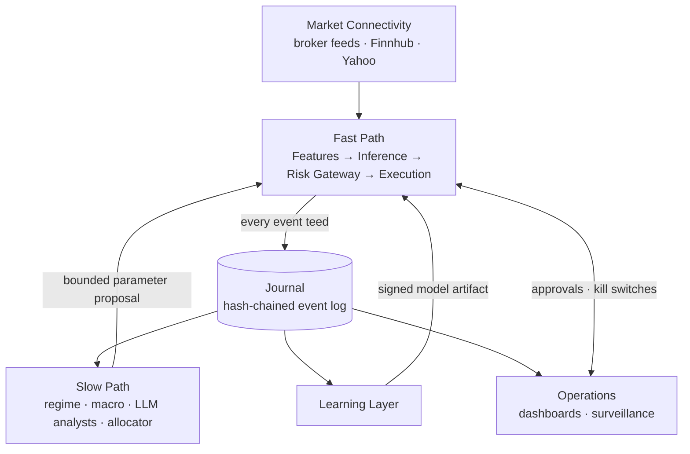
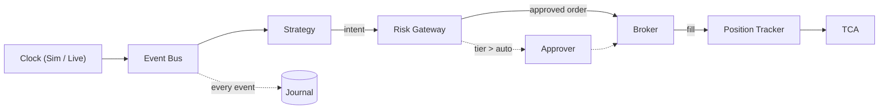
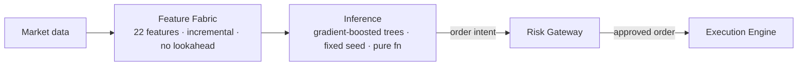
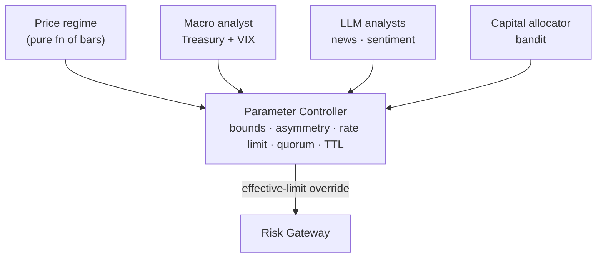
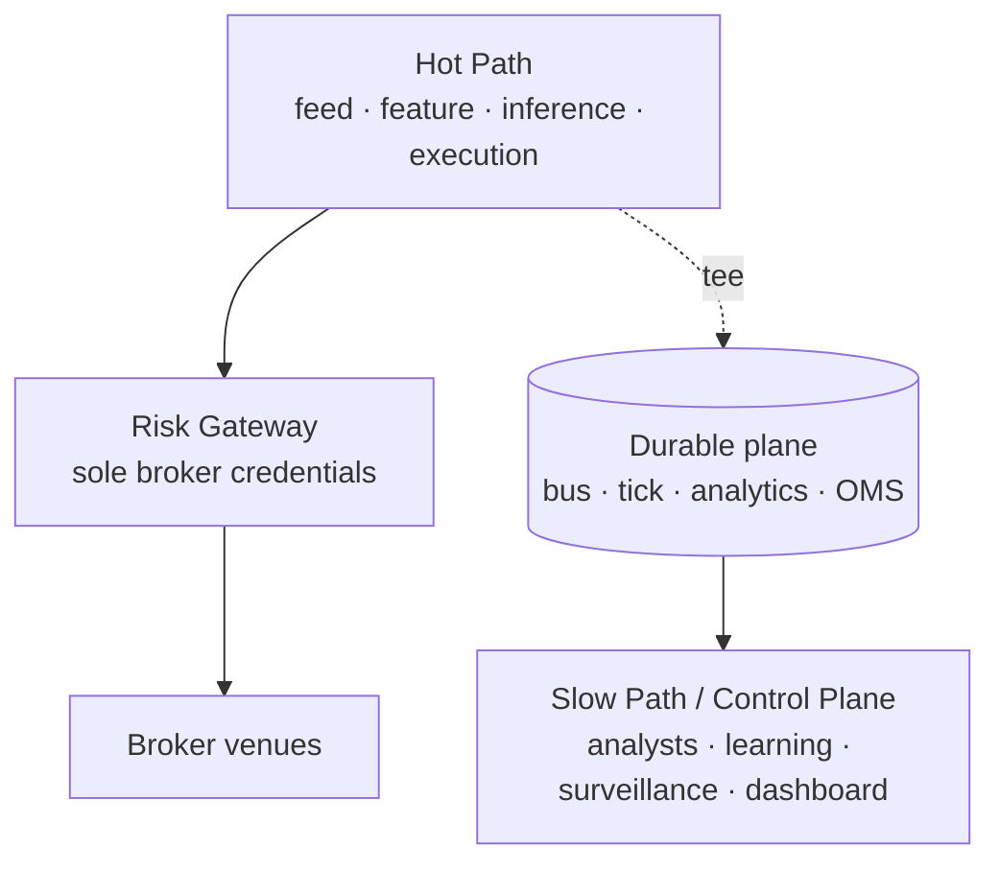
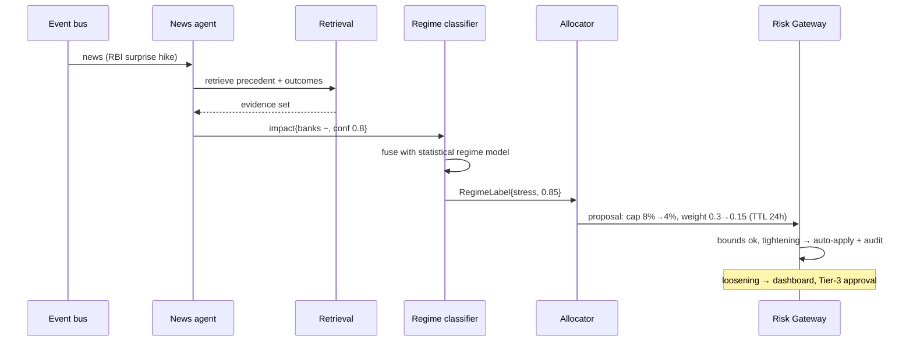
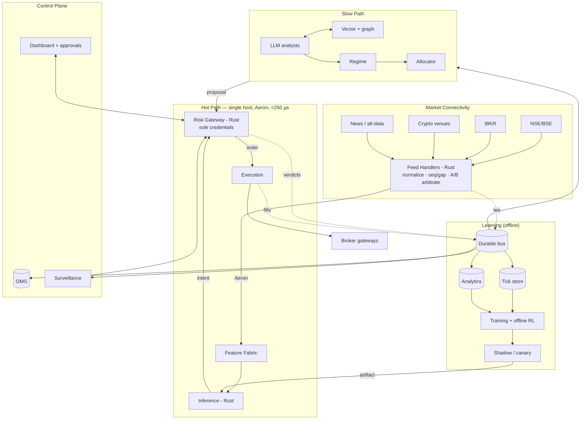

# Helios Capital — Enterprise AI Trading Platform: Architecture

**Canonical architecture reference.** Single source of truth for what the platform is, how it works, and what is built.
**Audience:** engineers (onboarding), Principal/Staff reviewers, Architecture Review Board, technical due diligence.
**Last reviewed:** 2026-07.

> **Precedence rule.** Parts 1–11 describe the system **as built**. The Roadmap and Appendices describe the **target-state** design and rationale. Where the two disagree about what exists today, the "as built" description wins.

### Status legend

| Marker | Meaning |
|---|---|
| ✅ **Production Ready** | Built, wired, and covered by tests. |
| 🟡 **Experimental** | Built, but opt-in, shadow-mode, or not yet hardened. |
| 🔵 **Planned** | On the roadmap with a defined phase; design settled, not yet implemented. |
| ⚪ **Future Vision** | Directional; depends on external prerequisites (e.g. exchange membership, colocation). |

---

## Table of Contents

1. [Executive Summary](#1-executive-summary)
2. [Current Build Status](#2-current-build-status)
3. [System Overview](#3-system-overview)
4. [High-Level Architecture](#4-high-level-architecture)
5. [Runtime & Event Flow](#5-runtime--event-flow)
6. [Component Architecture](#6-component-architecture)
7. [Storage Architecture](#7-storage-architecture)
8. [Security Architecture](#8-security-architecture)
9. [Deployment Architecture](#9-deployment-architecture)
10. [Technology Stack](#10-technology-stack)
11. [Roadmap](#11-roadmap)
12. [Appendices](#12-appendices)

---

## 1. Executive Summary

**What it is.** Helios Capital is an AI-assisted trading platform for Indian and international markets. It runs automated, multi-strategy trading with institutional-grade risk control and a complete audit trail, while keeping a human in command of anything consequential.

**The problem it solves.** Typical AI trading stacks place a language model directly in the trade-decision path — making decisions slow, non-reproducible, and unauditable — and treat risk management as advice that a bug can bypass. Helios removes those failure modes.

**What makes it unique.**

- **Reproducible by construction.** Backtest, shadow, and live trading run the same decision logic over the same recorded events, so any trading day can be reconstructed and re-run exactly.
- **AI is bounded, never in control.** Machine intelligence may only *tighten* risk or adjust strategy weights within hard limits; it can never place, modify, or cancel an order.
- **Risk is an unbypassable boundary.** No order reaches a broker without passing a single risk authority. Autonomy is earned per strategy and per order size, so human attention is spent only where it adds value.

**What is implemented today.** The full trading pipeline, multi-broker execution with transaction-cost analysis, a bounded AI intelligence layer, operator dashboards, and macro/symbology data enrichment are implemented and tested (~281 tests) on a single, free/OSS, CPU-only stack.

> **Honest constraint.** True sub-millisecond tick-to-trade requires exchange membership, colocation, and native protocols. Over a retail broker API, order placement costs 50–300 ms and market data arrives as conflated snapshots. The platform therefore targets a fast, venue-agnostic *internal* decision loop with a clean upgrade path to direct market access — and matches strategy selection to the latency tier actually available (intraday/swing now, microstructure only after DMA).

---

## 2. Current Build Status

The authoritative implementation map. Every major subsystem carries a status.

| Subsystem | Capability | Status |
|---|---|---|
| Event-sourced pipeline | Deterministic `bars → strategy → risk → broker → positions`, journaled & replayable | ✅ Production Ready |
| Decision model | Gradient-boosted trees, byte-identical, explainable | ✅ Production Ready |
| Risk Gateway | 9 pre-trade checks, kill switches K1–K4, working-order reservation, autonomy tiers | ✅ Production Ready |
| Execution Engine | Smart order routing, IS/VWAP/POV/Adaptive algos, pre-trade impact model | ✅ Production Ready |
| Transaction-cost analysis | Implementation-shortfall decomposition + markouts | ✅ Production Ready |
| Journal & audit chain | Hash-chained event log; deterministic replay verification | ✅ Production Ready |
| Multi-broker connectivity | Dhan, Upstox, Zerodha, IBKR; per-symbol routing + failover | ✅ Production Ready |
| Intelligence Layer (Slow Path) | Bounded parameter control; price + macro regime; provider-agnostic LLM analysts | ✅ Production Ready |
| Public-API enrichment | US Treasury + FRED macro, OpenFIGI symbology, Finnhub failover | ✅ Production Ready |
| Operator dashboards | Zero-dependency `/dash` + Next.js; journal projections; incident replay | ✅ Production Ready |
| Surveillance | Wash / spoof / layering detectors | ✅ Production Ready |
| Capital allocator | Thompson-sampling bandit over strategies; promotion gate | ✅ Production Ready |
| Macro regime service | Always-on macro poller feeding tightening proposals | 🟡 Experimental (opt-in) |
| Offline-RL execution agent | IQL/CQL for execution tactics | 🟡 Experimental (shadow only) |
| Durable event bus | Redpanda adapter | 🔵 Planned (journal is authoritative today) |
| Tick / analytics / OMS stores | QuestDB · ClickHouse · PostgreSQL | 🔵 Planned (SQLite today) |
| Rust hot path + Aeron IPC | Sub-millisecond internal loop | 🔵 Planned |
| Vector memory + knowledge graph | Qdrant + causal retrieval for analysts | ⚪ Future Vision |
| Direct market access / colocation | Native protocols, exchange colo | ⚪ Future Vision |

**Delivery milestones.** Phases 0–5, Layer 6 dashboards, and public-API enrichment are complete: (0) deterministic journaled pipeline + audit chain + risk boundary; (1) GBDT fast path + working-order reservation; (2) TCA + autonomy tiers; (3) bounded slow path (parameter control, regime, LLM analyst); (4) multi-broker execution + surveillance; (5) bandit allocator, promotion gate, offline-RL shadow, profiler, DMA economics; (6) read-side dashboards.

---

## 3. System Overview

The platform is organized as **five planes across two speeds, unified by one log.**

| Plane | Responsibility |
|---|---|
| **Market Connectivity** | Normalize ticks, depth, trades, news, and macro into one internal event schema with dual timestamps. Order gateways mirror this outbound. |
| **Event Backbone** | The durable, replayable system of record. Every event lands here. |
| **Fast Path** | Incremental feature computation and deterministic model inference. Output is an *order intent*, never an order. |
| **Risk & Execution** | The Risk Gateway is the sole order authority; behind it, the Execution Engine routes and measures fills. |
| **Slow Path** | News/macro/regime analysis on a seconds-to-hours cadence whose only output is a bounded parameter proposal. |

**Two speeds.** The **Fast Path** makes trade decisions and must be deterministic and low-latency. The **Slow Path** adapts strategy on a human-scale cadence and is forbidden from touching orders.

**One log.** Every event is journaled. Because the Fast Path is a pure function of its inputs, replaying the Journal reproduces identical decisions — **backtest/live parity is an architectural property, not a hope.**

### Core Principles

These invariants are the contract the design rests on. Stated once here; referenced, not repeated, elsewhere.

1. **AI is banned from the order path.** The Fast Path is deterministic; language models live only in the Slow Path as bounded advisors. *(Rationale: [Appendix A](#appendix-a--why-ai-never-sits-in-the-order-path).)*
2. **The Risk Gateway is the sole order boundary.** No order reaches a broker without an approved verdict. Fail-closed.
3. **Determinism is a contract.** Same configuration + same inputs → bit-identical intents, verdicts, orders, and fills. No wall-clock, randomness, or I/O in the decision function.
4. **The Slow Path can never block or break the Fast Path.** Every Slow-Path callback is sandboxed; a failure is swallowed and counted; trading continues on last-known-good parameters.
5. **Slow-Path writes are asymmetric.** Risk-*tightening* auto-applies within bounds; risk-*loosening* requires human approval. A hallucinating analyst can only make the system safer.
6. **Free/OSS until profitable.** Paid services are opt-in, never default.

---

## 4. High-Level Architecture

The system as built. Each plane is detailed in [§6](#6-component-architecture); this is the single-glance view.



Focused diagrams follow: [Runtime & Event Flow](#5-runtime--event-flow), [Fast Path](#62-fast-path-trading-engine), [Slow Path](#65-slow-path-intelligence-layer), and [Deployment](#9-deployment-architecture). The full target-state topology is [Appendix K](#appendix-k--target-state-reference-diagram).

---

## 5. Runtime & Event Flow

**What executes at runtime, and how events move through the system.**

A session assembler wires the pipeline in a fixed order and exposes two entry points that share identical configuration:

- **Live/backtest run** — replays a bar stream once through the pipeline.
- **Journal replay** — rebuilds a bit-identical session from journaled events alone.

> **Warning.** Construction and subscription order are part of the determinism contract. Component wiring must not be reordered.



**Event streams:** market bars/ticks, signal intents, risk verdicts, orders, order updates, fills, positions, parameter changes, parameter proposals, kill signals, approval requests, approval decisions.

**Determinism mechanics.** Timestamps are nanosecond UTC. The clock is injected — live trading uses a real clock, replay uses a simulated clock advanced from event timestamps. Injecting the clock is what makes replay reproduce live decisions exactly.

**Audit chain.** Every event is content-hashed and chained (each hash incorporates the previous), making the Journal tamper-evident. A verification script confirms the chain; nightly replay confirms determinism.

> **Note.** The three end-to-end walkthroughs — tick→order, news→parameter change, fill→learning, with per-hop latency — are in [Appendix H](#appendix-h--data-flow-walkthrough).

---

## 6. Component Architecture

Each component is described once, authoritatively.

### 6.1 Market Connectivity

**How market data enters the platform.** Per-symbol routing selects the best available source with a documented fallback chain.

- **Sources.** Indian brokers via live SDK (Dhan, Upstox, Zerodha); IBKR for global; Finnhub as a keyed failover; Yahoo Finance as delayed fallback.
- **Quote routing.** `broker → Finnhub → Yahoo`; each quote reports which source served it. Selection is per-symbol with a short cache and data-plan probing.
- **Symbology (✅).** An OpenFIGI resolver maps any ticker to a broker-neutral identifier, eliminating cross-broker symbol skew.

🔵 **Planned:** dedicated Rust feed handlers with sequence-gap detection, A/B feed arbitration, and raw capture; additional venues. *(Motivation: [Appendix C](#appendix-c--original-design-audit), item 4.)*

### 6.2 Fast Path (Trading Engine)

**How trade decisions are made.** Every order originates from this deterministic pipeline.



- **Feature Fabric.** 22 features (13 technical indicators + 9 strategy-tournament votes), computed incrementally with no lookahead. Indicator code is shared with the training path, giving zero train/live skew.
- **Inference.** A pure function. Gradient-boosted trees with a fixed seed produce a byte-identical model. Models are versioned, signed artifacts verified at load. Every decision logs its model id, feature-vector hash, score, and top attributions.
- **Determinism rule.** No wall-clock, randomness, or I/O in the decision function; inputs are the event and feature state only. *(Model rationale: [Appendix B](#appendix-b--technology-rationale).)*

🔵 **Planned:** port to Rust over shared-memory IPC; microstructure features once feed-tier data supports them.

### 6.3 Risk Gateway

**How risk is enforced.** The Risk Gateway is the platform's security boundary and sole order authority ([Principle 2](#core-principles)).

Built (✅):

- **Pre-trade checks** — 9 synchronous checks; fail-closed.
- **Kill switches** — four escalation levels (K1–K4).
- **Working-order reservation** — reserves the signed quantity of approved-but-unfilled orders so a burst cannot breach limits before fills land.
- **Parameter overrides** — consumes Slow-Path parameter changes as effective-limit overrides.
- **Autonomy tiers** — each intent is scored Tier 1/2/3; the gateway auto-releases only within the configured tier, otherwise it raises an approval request. Nothing is autonomous until earned.

🔵 **Planned:** re-implement as an isolated process that exclusively holds broker credentials, making it unbypassable by construction; sub-50 µs budget; hot standby.

> **Note.** Full pre-trade controls, portfolio-risk controls, the kill-switch table, and the autonomy-tier matrix are in [Appendix F](#appendix-f--risk-controls-reference).

### 6.4 Execution Engine

**How orders are executed.** Built (✅):

- **Smart Order Router** — health-scored broker selection with failover.
- **Execution algorithms** — IS, VWAP, POV, Adaptive slicing.
- **Pre-trade impact model** — Almgren-Chriss cost estimate.
- **Transaction-cost analysis** — implementation-shortfall decomposition with markouts at +1/+5/+30 bars.

🔵 **Planned:** analytics to a columnar store; wider markout horizons; deeper cross-broker routing. *(Shortfall math: [Appendix E](#appendix-e--learning--rl-deep-design).)*

### 6.5 Slow Path (Intelligence Layer)

**How the platform adapts strategy.** Cadence: seconds to hours. Power: bounded parameter control. Prohibition: it can never touch an order ([Principle 1](#core-principles)). It reaches the gateway through exactly one typed boundary.



Built (✅):

- **Parameter Controller** — the only write interface. Enforces bounds, direction asymmetry (tighten auto; loosen held for approval), rate limiting, quorum (≥ N independent sources), and TTL decay to baseline.
- **Price regime classifier** — a pure function of the bar stream; tightens on volatility spikes.
- **Macro regime analyst** (🟡 opt-in service) — reads the Treasury yield curve + implied volatility, classifies `{none, stress, crisis}`, and emits tighten-only exposure proposals; hosted on a long-lived bus with automatic TTL decay.
- **LLM analysts** — provider-agnostic; convert a news/macro item into a bounded proposal; governed for lifecycle, budget, and auto-pause.
- **Capital allocator** — Thompson-sampling bandit over strategy/parameter arms, with a champion-promotion gate.

If the entire Slow Path dies, trading continues on last-known-good parameters ([Principle 4](#core-principles)).

#### Public-API enrichment (✅)

Three free public sources, confined to the Slow Path and product surface — off the Fast Path, order path, and replay. All are key-optional (blank key ⇒ source disabled, app unchanged) and fail-closed to empty.

| Source | Key | Role |
|---|---|---|
| US Treasury yield curve | none | 10Y-2Y spread; inversion = stress precursor |
| FRED | free | implied-volatility and other macro series |
| OpenFIGI | keyless (key raises limit) | broker-neutral instrument identifier |
| Finnhub | free | market-data failover tier + news sentiment |

🔵 **Planned:** frontier analysts with cited retrieval over a vector store + knowledge graph; opt-in paid vendors. *(Target slow-path spec: [Appendix D](#appendix-d--slow-path-target-design). Detail: [`PUBLIC_API_ENRICHMENT.md`](./PUBLIC_API_ENRICHMENT.md).)*

### 6.6 Learning Layer

**How models are trained and promoted.** Offline-first, with safe deployment. Built (✅):

- **Strategy tournament** — walk-forward backtesting across 6+ strategies per symbol with purged cross-validation, min-trade gates, and fee modeling; the live agent trades the winner.
- **Capital allocation** — contextual bandit (see [§6.5](#65-slow-path-intelligence-layer)).
- **Champion–challenger** — shadow → canary → promotion, gated by probabilistic Sharpe ratio.
- **Data pipeline** — forward-return labels with no leakage; store-first data fetch; signed model artifacts.

🟡 **Experimental:** offline-RL execution agent (shadow only). *(Risk analysis, algorithm comparison, reward function, credit assignment, and the promotion gate are in [Appendix E](#appendix-e--learning--rl-deep-design).)*

### 6.7 Operations Layer

**How operators observe and control the platform.** Built (✅):

- **Dashboards** — a zero-dependency operator UI plus a Next.js frontend, both read-side projections over the Journal (Trading, Risk, AI, TCA, Replay, Platform), including incident replay that diffs a regenerated stream against the Journal.
- **Surveillance** — wash / spoof / layering detectors.
- **Performance tracking** — hit rate, expectancy, and outcome grading at horizons.

🔵 **Planned:** streaming surveillance jobs and richer approval surfaces. *(Detectors + compliance: [Appendix G](#appendix-g--compliance--surveillance).)*

---

## 7. Storage Architecture

**Where state lives.** Today, persistence is an embedded relational database plus an append-only event log.

| Store | Contents | Status |
|---|---|---|
| Operational DB | OMS, trades, recommendations, broker accounts | ✅ |
| Bar store | Durable OHLC history (store-first fetch) | ✅ |
| Journal | Hash-chained event log — source of truth for replay | ✅ |
| TCA store | Transaction-cost analytics | ✅ |

**Schema (operational DB):** users; broker accounts (encrypted credentials, connection status, token expiry); recommendations (with grading fields); trades; risk limits (gates + kill-switch state); market regimes.

🔵 **Planned:** purpose-built engines already stubbed behind opt-in dependencies — a durable replayable bus, a tick store, a columnar analytics store, a transactional OMS store, and a vector store (Slow Path only). The embedded DB is single-writer, so heavy ingest and a live session contend — a primary migration driver. *(Engine rationale: [§10](#10-technology-stack).)*

---

## 8. Security Architecture

**How the platform protects capital and credentials.** Built (✅):

- **Credentials at rest** — authenticated encryption; raw keys never returned by the API.
- **Order boundary** — the Risk Gateway is the only path to a broker; the kill switch halts all trading in under one second.
- **Broker isolation** — the execution router never routes real orders to paper accounts.
- **Approval flow** — every order is preview → confirm; live orders get a distinct confirmation.
- **Audit** — the hash-chained Journal is tamper-evident and supports full trade reconstruction by replay.
- **Broker credential lifecycle** — token-based Indian brokers expire daily (SEBI); IBKR uses Gateway/TWS with no API key.

🔵 **Planned:** broker credentials scoped exclusively to an isolated Risk-Gateway process with strategy-host egress firewalled off; four-eyes approval on risk-limit raises; WORM audit archive with 7-year retention. *(Compliance/jurisdiction + surveillance: [Appendix G](#appendix-g--compliance--surveillance).)*

---

## 9. Deployment Architecture

**How the platform is deployed.**

**Today (✅).** A single-process application serves the API and operator dashboard; the frontend runs separately; state is local. One command brings up the backend, dashboard, and optional legacy UI.

**Target (🔵⚪).** A single-host hot path on pinned CPU cores; the Risk Gateway on its own hard-isolated host as sole credential holder; a durable data plane (replayable bus, tick store, columnar analytics, transactional OMS, WORM archive); and a Slow Path / control plane on managed Kubernetes. Clocks are PTP-disciplined. Environments progress `research → paper → prod`, where **paper is a permanent, always-on soak environment.**



*Full blueprint (host topology, standby, fencing, secrets, clocks): [Appendix I](#appendix-i--target-deployment-blueprint).*

---

## 10. Technology Stack

The current stack is Python + FastAPI + an embedded database. The table below is the **target** matrix; the Status column maps each choice to its build state. Rationale is preserved verbatim.

| Concern | Technology | Status | Why chosen | Alternatives | Trade-offs |
|---|---|---|---|---|---|
| Hot path (feed, features, inference, risk, execution) | **Rust** | 🔵 (Python today) | memory-safe, no GC pauses; µs-predictable; one language across the hot path | C++ (footguns), Go (GC 0.5–10 ms), Java+Chronicle (JVM tax) | smaller talent pool; slower iteration — mitigated by keeping research in Python |
| Research, training, Slow-Path services | **Python** (Polars, LightGBM, PyTorch) | ✅ | ecosystem; iteration speed | Julia (ecosystem risk) | never in the order path after Phase 3 |
| Control-plane services | **FastAPI** now; Go if the team grows | ✅ | already started; latency-insensitive | Go, TS/Node | fine as-is |
| Hot-path messaging | **Aeron** | 🔵 (in-process bus today) | shared-memory IPC, single-digit µs | Chronicle (JVM), raw rings (NIH), iceoryx2 | operational learning curve; hot path only |
| Durable event bus | **Redpanda** | 🔵 (Journal authoritative today) | Kafka API, no ZooKeeper/JVM; strong replay | Kafka (ops), NATS JetStream (replay tooling), Pulsar (overkill) | smaller community; acceptable |
| Tick / bar store | **QuestDB** | 🔵 (embedded DB today) | millions rows/s; SQL; built for ticks | TimescaleDB (~10× slower ingest), kdb+ (cost), Parquet (no live query) | younger ecosystem; bus is the true system of record |
| Analytics / TCA / audit | **ClickHouse** | 🔵 (embedded store today) | columnar scans over billions of events in seconds | BigQuery/Snowflake (egress, lock-in), DuckDB (single-node) | cluster ops; start single-node |
| OMS / positions / reference | **PostgreSQL** | 🔵 (embedded DB today) | correctness, FKs, transactions | — | not for ticks, ever |
| Hot state / session cache | **Redis** (Dragonfly if needed) | 🔵 (in-process today) | ubiquitous; sub-ms | Dragonfly, KeyDB | hot-path state lives in-process; Redis for control plane |
| Feature store | **Feast** offline + in-process fabric online | 🟡 (fabric ✅; registry planned) | declarative training/serving parity | Tecton (cost), homegrown | online store too slow for µs serving — serve from the fabric |
| Vector store | **Qdrant** | ⚪ | HA, filtering, performance | pgvector (interim), Weaviate, Milvus | one more service; Slow Path only |
| Slow-Path models | Frontier LLM APIs (structured output) | ✅ (provider-agnostic) | best reasoning per ₹; structured proposals | self-hosted Llama-class | API dependency tolerable — not availability-critical |
| Macro / enrichment data | US Treasury + FRED + OpenFIGI + Finnhub | ✅ | free tiers; no extra deps | OpenBB SDK, paid vendors | key-optional, fail-closed; off the Fast Path |
| Orchestration | **Kubernetes** (managed) | 🔵 (single-process today) | standard ops, autoscaling | Nomad | **never** for the hot path |
| Hot-path hosts | **Pinned VMs / bare metal**; colo at DMA | ⚪ | K8s jitter is poison for µs paths | K8s static CPU manager | manual ops for 2–3 boxes |
| IaC / deploy | Terraform + GitOps; Ansible for hot hosts | 🔵 | reproducibility; audit history | — | — |
| Secrets | Vault (or cloud KMS/SM) | 🔵 | credential scoping to the Risk Gateway | — | — |
| Observability | Prometheus + Grafana + OpenTelemetry | 🔵 | histogram-native (µs buckets) | Datadog (cost at tick volume) | self-host effort |

---

## 11. Roadmap

Sequenced for **risk reduction first, speed last** — at retail latency, correctness and measurement pay immediately while microseconds do not. Phases 0–5 are complete (✅); remaining Rust/Aeron/DMA work is 🔵⚪.

| Phase | Build | Exit criteria |
|---|---|---|
| **0 — Truth & Safety** | Event schema + durable bus; ns timestamps; audit chain; paper env; migrate bar store | every action reconstructable; paper runs a full day unattended |
| **1 — Deterministic decisions + real risk** | GBDT Fast Path (Python); Risk Gateway v1; all orders gated; credentials moved to gateway scope | 100 % of orders gated; internal p99 < 10 ms; no ungated path (network-policy verified) |
| **2 — Measurement & parity** | TCA pipeline; fill simulator; backtest = Journal replay; autonomy tiers v1 | replay-determinism green nightly; TCA on every fill; first Tier-1 gated on 4 clean weeks |
| **3 — Slow Path & feeds** | LLM analysts + retrieval + regime classifier emitting bounded proposals; second feed | Slow-Path outage provably harmless (chaos test); tighten auto / loosen approved |
| **4 — Multi-broker & execution** | IBKR; SOR; execution algos; reconciliation; surveillance live | slippage ≤ impact-model baseline; failover drill passed |
| **5 — Learning & speed** | Bandit allocator; offline-RL research (shadow); Rust + Aeron hot path; DMA economics | promotions only via the [gate](#appendix-e--learning--rl-deep-design); internal p99 < 1 ms; DMA go/no-go memo |

**Deprecated on the path to target:** AI as trade decider; embedded vector DB in the decision path; per-trade human approval as the only control; direct broker calls from strategy code.
**Retained:** the strategy-tournament concept (it *is* champion–challenger); store-first data fetch; the dashboard approval flow (becomes the Tier-2/3 surface); a transactional OMS; the explainability ethos (enforced via logged attributions).

> **Latency caveat (restated).** Retail tier = 50–300 ms venue latency + conflated snapshots. Any sub-millisecond figure in this document is internal-pipeline only until direct market access.

> **Open questions:** target capital and instrument scope for Phase-1 paper trading; the second venue (IBKR vs Dhan/Fyers as NSE backup); whether F&O enters before or after Phase 4 (margin/SPAN logic is the long pole).

---

## 12. Appendices

Reference material — deep rationale, quantitative analysis, and target-state specifications. Nothing here contradicts Parts 1–11.

<details>
<summary><b>Appendix index</b></summary>

- [A — Why AI never sits in the order path](#appendix-a--why-ai-never-sits-in-the-order-path)
- [B — Technology rationale](#appendix-b--technology-rationale)
- [C — Original-design audit](#appendix-c--original-design-audit)
- [D — Slow-Path target design](#appendix-d--slow-path-target-design)
- [E — Learning & RL deep design](#appendix-e--learning--rl-deep-design)
- [F — Risk controls reference](#appendix-f--risk-controls-reference)
- [G — Compliance & surveillance](#appendix-g--compliance--surveillance)
- [H — Data-flow walkthrough](#appendix-h--data-flow-walkthrough)
- [I — Target deployment blueprint](#appendix-i--target-deployment-blueprint)
- [J — Latency & throughput budgets](#appendix-j--latency--throughput-budgets)
- [K — Target-state reference diagram](#appendix-k--target-state-reference-diagram)
- [L — Failure-mode analysis](#appendix-l--failure-mode-analysis)
- [M — Black-swan response plan](#appendix-m--black-swan-response-plan)

</details>

### Appendix A — Why AI never sits in the order path

A language model is an excellent *analyst* and a poor *executor*. It writes to parameters — slowly, boundedly — never to orders. The reasons:

- **Latency.** LLM p50 is 1–10 s; intraday alpha half-life is often seconds. The trade is dead before the tokens finish.
- **Non-determinism.** Identical state can produce different orders — unacceptable for risk control, regulators (MiFID II RTS 6; SEBI strategy registration), and debugging.
- **Non-replayability.** Yesterday's incident cannot be re-run if the decision is a sampled distribution behind a third-party API.
- **Hallucination under distribution shift.** During black swans — inputs never seen — the failure mode is confident fabrication: the worst property at the worst time.
- **Availability coupling.** An external API outage becomes a trading outage.
- **Cost scaling.** Token cost × decisions/day taxes every trade; tree inference is effectively free.

### Appendix B — Technology rationale

**Gradient-boosted trees for decisions.** Per-strategy classifiers/regressors predict the probability of a favorable move and expected-return quantiles. Chosen over deep nets for: tabular dominance; monotonic constraints (e.g. "wider spread never increases buy aggression"); native feature attribution (per-decision SHAP-style logs satisfy explainability); and microsecond inference. A lightweight online layer recalibrates scores intraday under strict learning-rate caps — adapting *calibration, not structure*.

**Rust for the hot path.** Memory safety without a GC (no pause in the order path), fearless concurrency for lock-free limit tables, `#![forbid(unsafe_code)]` in the checking core, exhaustive `match` on order states, and a small attack surface.

**Event sourcing.** A durable, replayable log makes backtest, shadow, and live the same code path — parity as an architectural property — and yields a tamper-evident audit trail.

### Appendix C — Original-design audit

Audit of the *original* multi-agent-LLM design, retained as motivation. Severity 10 = capital-destroying. Roughly 5 % of the original existed in code — effectively no legacy to migrate.

| # | Subsystem | Root cause | Impact | Sev | Fix |
|---|---|---|---|---|---|
| 1 | Multi-agent LLM decisioning | LLMs in the trade-decision critical path | 5–30 s/decision; non-deterministic; unauditable; token cost scales with trades | 10 | Split fast/slow path; deterministic trees in Rust; LLMs → parameter advisors |
| 2 | "Risk Agent" | Risk modeled as advice, not a boundary | Any bug bypasses risk; one loop can send unlimited orders | 10 | Standalone Rust Risk Gateway; sole credential holder; kill switches |
| 3 | Online-RL loop | Online weight updates on non-stationary reward | Catastrophic forgetting; feedback loops; reward hacking; feedback poisoning | 9 | Offline RL + bandit allocation; shadow→canary→champion; risk-adjusted reward |
| 4 | Market-data ingestion | Broker SDK treated as a data platform | Undetected gaps; no replay; GC stalls the only feed; no microstructure features | 9 | Rust feed handlers; gap detection; A/B arbitration; raw capture |
| 5 | Human-approves-every-trade | Approval as the only safety mechanism | Alpha gone before approval; approval fatigue; blocks scaling | 8 | Dynamic autonomy tiers |
| 6 | Execution | Execution as an API call, not a discipline | Full spread + impact; no measurement; single broker | 8 | Impact model + algo suite + multi-broker SOR + TCA |
| 7 | Storage | No separation of tick / analytics / OMS | Postgres can't ingest ticks; Chroma has no HA; regimes ≠ similarity | 7 | QuestDB + ClickHouse + Postgres + Qdrant + Redis |
| 8 | Event transport | No event backbone | No replay, audit, or decoupling; back-pressure | 9 | Aeron (hot) + Redpanda (durable) |
| 9 | Compliance | Absent | SEBI non-compliance; no surveillance; termination risk | 9 | Pre-trade enforcement + post-trade surveillance + WORM audit |
| 10 | Observability / DR | Prototype posture | Silent failures; no reconstruction; undefined outage behavior | 9 | Metrics + tracing + WORM audit + documented DR |
| 11 | RAG in decision path | Similarity conflated with causal relevance | Confident wrong retrieval; 50–500 ms in path | 7 | Slow Path only; Qdrant + knowledge graph |
| 12 | Implementation reality | Early stage | Audit is of the *design*; nothing is sunk cost | — | Treat as greenfield |

> **Stress behavior of the original design was undefined** — for a trading system, that means capital-destroying. This is the core motivation for the redesign.

### Appendix D — Slow-Path target design

The built Slow Path ([§6.5](#65-slow-path-intelligence-layer)) realizes the following target design.

**Target agent roster (frontier LLMs):**

| Agent | Inputs | Output (typed, bounded) |
|---|---|---|
| News intelligence | news, filings, retrieval | `EventImpactAssessment{symbols, direction, confidence, half_life}` |
| Macro analyst | RBI/Fed calendars, prints vs consensus | `MacroStateUpdate{rates_outlook, liquidity_state}` |
| Earnings interpreter | transcripts, results vs estimates | per-symbol drift/vol expectations |
| Geopolitical monitor | curated feeds | `TailRiskAlert{severity, affected_sectors}` |
| Regime classifier | all above + realized vol/corr/breadth | `RegimeLabel ∈ {trend, chop, stress, crisis}` + confidence |

**Supporting memory (⚪):** a vector store plus a knowledge graph with typed causal edges (event →[preceded]→ outcome, company →[supplier_of]→ company) so retrieval is causal-ish, not just similar. Analysts must cite evidence IDs, stored with each proposal.

**The only write interface — `ParameterChangeProposal`:**

```json
{
  "proposal_id": "uuid",
  "source_agent": "regime_classifier",
  "parameter": "strategy_weight.momentum_v3",
  "current": 0.30, "proposed": 0.15,
  "ttl": "4h",
  "evidence": ["news:8821", "kg:edge:4410", "vol:realized_5m=4.2sigma"],
  "rationale": "regime shift trend→stress; momentum alpha decays in stress"
}
```

Enforcement (in the gateway / Parameter Controller): **bounds** (min/max, max step, max frequency); **direction asymmetry** (tighten auto; loosen queues for approval); **TTL** (expires to baseline unless renewed); **rate limit + quorum** (large regime shifts need ≥ 2 independent signals — LLM assessment + statistical model).



### Appendix E — Learning & RL deep design

**Online-learning risks → mitigations:**

| Risk | Original mechanism | Target mitigation |
|---|---|---|
| Catastrophic forgetting | weight updates on recent PnL | offline training on full history, regime-stratified; models are versioned; old champion restorable |
| Feedback loops | own trades move price → reward | train on counterfactual mid-price markouts; cap participation; subtract estimated own-impact |
| Reward hacking | raw PnL reward | risk-adjusted reward with penalties; hard action-space constraints enforced by the gateway |
| Overfitting | unconstrained fit | walk-forward + purged/embargoed CV; deflated Sharpe; min-sample gates |
| Human-feedback poisoning | feedback updates weights | feedback only labels data for offline review; never a gradient |

**Reward (per strategy, per period):** `r_t = ΔNAV_t − λ·σ̂_t(ΔNAV) − κ·Turnover_t − c·Costs_t − β·DD_t`, with λ calibrated toward max-Sharpe, κ penalizing churn, DD_t the incremental drawdown. Coefficients are versioned; changing the reward is a new experiment.

**Algorithm choice:**

| Algorithm | Verdict |
|---|---|
| DQN | No — overestimation bias; brittle under non-stationarity |
| PPO | Simulators only — on-policy; live interaction = live risk |
| A2C/A3C | No — weaker PPO |
| SAC | Best online-family for sizing — sim/shadow only |
| **Offline RL (IQL/CQL)** | **Primary** — learns from logged data; conservatism penalizes out-of-distribution actions |
| **Contextual bandit (Thompson)** | **Production allocator** — no trajectory credit-assignment problem |

**Three layers, decreasing autonomy:** (1) supervised trees predict returns — most edge lives here; (2) contextual bandit allocates capital across strategies given regime context; (3) offline-RL research for execution tactics, shipping only through the pipeline below.

**Implementation-shortfall (Perold) decomposition** — with p_d = decision price, p_a = arrival, p̄_f = avg fill, q* = intended, q = filled, p_T = mid at horizon T:

```
IS = (p̄_f − p_d)·q + (p_T − p_d)·(q* − q)
   = Delay cost       (p_a − p_d)·q          ← latency: broker, network, human approval
   + Execution cost   (p̄_f − p_a)·q          ← spread + market impact
   + Opportunity cost (p_T − p_d)·(q* − q)    ← unfilled quantity
```

Attribution: **bad signal** via markout `α_h = E[mid_{t_d+h} − mid_{t_d}]·side` over h ∈ {1s,10s,1m,5m,30m}, measured against mid; **latency** via ns-stamped hops `t_signal → t_intent → t_risk_ok → t_sent → t_broker_ack → t_exchange_ack`; **human delay** over `[t_notified, t_approved]`, per user; **slippage vs noise** via microprice marks and the square-root baseline `ΔP ≈ Y·σ·√(Q/ADV)`.

**Safe-learning pipeline:** `offline train → offline eval (OPE) → shadow → canary (5% capital) → champion`.

1. **Offline eval:** walk-forward, purged/embargoed CV; deflated Sharpe; doubly-robust off-policy estimate `V̂_DR(π) = (1/n)Σᵢ[V̂(sᵢ) + ρᵢ(rᵢ − Q̂(sᵢ,aᵢ))]`, weights clipped.
2. **Shadow:** challenger consumes the live stream into a fill simulator; ≥ 4 weeks or ≥ 200 trades.
3. **Canary:** 5 % capital, scaled-down limits; auto-rollback on drawdown > 2× champion, slippage > model + 50 %, or any hard-limit hit.
4. **Promotion gate:** PSR(challenger > champion) ≥ 0.95; max-DD within mandate; TCA not worse. Promotion = config change + audit; old champion kept warm.
5. **Counterfactual test:** weekly replay through both models; divergence report reviewed before promotion.

### Appendix F — Risk controls reference

**Pre-trade (synchronous, target < 50 µs):**

| Control | Check | Default |
|---|---|---|
| Position limits | per-symbol net/gross qty and notional post-order | ≤ 2 % NAV |
| Exposure limits | gross/net portfolio, per-sector, per-strategy | gross ≤ 150 % NAV, sector ≤ 15 % |
| Fat-finger | size vs ADV and 30-day avg; price collar vs LTP | ≤ 1 % ADV; ±3 % of LTP |
| Rate limits | orders/sec per strategy; order-to-trade ratio | throttle below penalty onset |
| Margin | SPAN + exposure vs available | ≥ 25 % buffer |
| Liquidity | order ≤ x % of visible depth within 5 bps | ≤ 20 % of top-3 depth |
| Self-trade prevention | cross against own resting order → cancel-newest | always on |

**Asynchronous (portfolio, 100 ms–1 s):** VaR (95/99) + CVaR; factor/beta caps; correlation concentration; drawdown ladders (−2 % → halve sizes; −4 % → suspend Tier 1; −6 % → flatten + page). Breaches flip pre-trade limit tables, keeping the sync path fast.

**Kill switches:**

| Level | Action | Trigger |
|---|---|---|
| K1 | halt one strategy | strategy anomaly; or one click |
| K2 | cancel resting orders, block new entries | feed-integrity failure, position mismatch; or risk officer |
| K3 | de-risk ladder to flat (passive → aggressive) | black-swan triggers; or risk officer |
| K4 | drop broker sessions, platform dark | big red button; auto on gateway self-check failure |

*K4 works when all else is down: an independent watchdog + broker-side cancel-on-disconnect, tested monthly in paper.*

**Autonomy tiers:**

| Tier | Mode | Conditions (all must hold) |
|---|---|---|
| **1 — Autonomous** | execute immediately | liquid; ≤ 0.25 % NAV and ≤ 0.5 % ADV; limits ≥ 30 % headroom; regime ∈ {trend, chop}; confidence ≥ threshold; champion |
| **2 — Conditional** | notify; auto-execute after timeout unless vetoed; size −50 % on timeout | order ≤ 1 % NAV; headroom 10–30 %; regime = stress; event window; canary |
| **3 — Human required** | no execution without approval; expires after TTL | new strategy (2 wks); > 1 % NAV; illiquid; regime = crisis; post-kill resumption; any loosening; verdict override (four-eyes) |

*Tier is a deterministic per-intent function; any failing condition drops a tier; ≥ 3 Tier-2 vetoes/session auto-suspend to Tier 3. Crisis→normal de-escalation needs both the statistical model and human confirmation.*

### Appendix G — Compliance & surveillance

Two halves: **pre-trade enforcement** (in the Risk Gateway, synchronous) and **post-trade surveillance** (streaming jobs).

**Jurisdiction targets:**

| Regime | Obligations engineered for |
|---|---|
| SEBI (primary) | algo registration; per-order strategy-ID tag; broker kill switch; ≥ 5 y audit (we keep 7); OTR limits; broker/exchange SOR only |
| RBI | FX/cross-border (LRS; crypto via FIU-registered exchanges, PMLA/KYC) |
| SEC/FINRA (US via IBKR) | Rule 15c3-5 pre-trade controls — the gateway is the documented control; CAT-compatible records |
| MiFID II (if EU) | RTS 6 (testing, kill, self-assessment); RTS 25 clock sync ≤ 100 µs — the ns-timestamp design conforms |

**Real-time enforcement:** self-trade prevention; price collars; restricted/halted list; position-limit regs; rate/OTR throttles; mandatory strategy-ID tag (reject untagged).

**Surveillance detectors** (post-trade, streaming; each emits a scored alert, K1-capable):

- **Wash** — matched fills between commonly-owned accounts; no beneficial-ownership change.
- **Spoofing** — large non-marketable orders cancelled within Δt, correlated with own opposite-side fills; `score = P(cancel | opposite fill) × size percentile`.
- **Layering** — ≥ 3 stacked levels one side, execution the other within a window.
- **Momentum ignition** — own participation > x % of volume during acceleration.
- **Front-running** — ordering analysis between signal-access accounts and platform orders.

> A book-trading platform can produce these patterns *accidentally* (an aggressive cancel algo can look like spoofing). Surveillance is self-protective — detect and fix before the exchange does.

**Audit logging:** every event content-hashed and chained → tamper-evident; WORM retention; ns timestamps; reconstruction by deterministic replay. Regulatory reports are queries, not archaeology.

### Appendix H — Data-flow walkthrough

**A. Tick → order (Fast Path):**
1. Tick arrives; decode, normalize, dual-stamp (ns); sequence-check (gap → mark stale). *+15 µs*
2. Publish on the hot bus; async tee to the durable bus. *+5 µs*
3. Feature Fabric updates incrementally (OBI, microprice, momentum, spread EWMA, volume accel, VPIN bucket). *+40 µs*
4. Inference scores active strategies; emits an order intent with model id + attributions. *+80 µs*
5. Risk Gateway runs ~15 sync checks → approved, tier 1. *+40 µs*
6. Execution routes a single IOC limit at microprice+offset with an algo tag. *+20 µs*
7. **Internal ≈ 200 µs.** Venue leg: colo 100–300 µs / retail 50–300 ms.
8. Ack + fill → positions updated → fill on the bus → TCA computes slippage vs impact model; markouts scheduled.
9. Every artifact is journaled; nightly replay verifies determinism.

**B. News → parameter change (Slow Path):** RBI surprise hike → precedent retrieval → impact (banks −, 0.8) → regime fusion → stress label → allocator proposes sector cap 8→4 %, weight 0.30→0.15, TTL 24 h → gateway validates, tightening → auto-apply + audit + banner. ~20 s. Zero orders touched; the *next* intent meets tighter limits.

**C. Fill → learning:** fills + markouts + shortfall land in analytics → nightly TCA, signal-decay curves, feature drift, bandit posterior update → weekly walk-forward retrain → shadow → gate → canary.

### Appendix I — Target deployment blueprint

- **Hot path:** 2× dedicated hosts (pinned VMs → colo). `isolcpus` + core pinning per service, NUMA-local memory, busy-poll sockets; kernel-bypass only at colo. No orchestration on these boxes; immutable releases.
- **Risk Gateway:** own host in a separate account/VPC; only holder of broker credentials; strategy-host egress firewalled. Hot standby with journal replication and session fencing.
- **Durable plane:** replayable bus ×3 (NVMe), tick store primary+replica, columnar analytics, OMS HA, WORM object storage.
- **Slow Path / control plane:** managed Kubernetes; namespaces for analysts, learning, surveillance, dashboard. mTLS mesh (never on the hot path).
- **Clocks:** PTP-disciplined; all timestamps UTC ns.
- **Security:** per-service secret scopes; short-lived creds; signed artifacts verified at load; four-eyes on limit raises; no human prod-shell on hot hosts.
- **Environments:** `research → paper → prod`; paper is permanent, where every change soaks.

### Appendix J — Latency & throughput budgets

**Fast-path component budget (DMA tier):**

| Component | Budget | Notes |
|---|---|---|
| Feed decode + normalize | 5–20 µs | zero-copy parse |
| Feature update | 20–50 µs | O(1)/O(k) per tick |
| Model inference | 30–80 µs | compiled trees; no Python in path |
| Risk pre-trade | 10–50 µs | lock-free tables |
| Order encode + route | 10–20 µs | persistent sessions |
| **Internal total** | **~100–250 µs p50, < 1 ms p99** | |

**End-to-end by tier:**

| Stage | DMA/colo (⚪) | Retail today |
|---|---|---|
| Venue → feed handler | 5–50 µs | 5–80 ms (conflated ~1 snapshot/s) |
| Decode + normalize | 5–20 µs | 0.1–0.5 ms |
| Feature update | 20–50 µs | 0.3–1 ms |
| Inference | 30–80 µs | 0.5–2 ms |
| Risk validation | 10–50 µs | 0.2–1 ms |
| Order encode/route | 10–20 µs | 0.1 ms |
| **Internal tick→order** | **~100–250 µs p50; < 1 ms p99** | **~1–5 ms p50; < 10 ms p99** |
| Gateway → venue ack | 50–300 µs | 50–300 ms |
| Exchange matching | 50–200 µs | same |
| **Tick → exchange ack** | **~0.3–1 ms** | **~60–400 ms** |
| News → parameter change | 5–60 s | same |
| Kill switch K2 issued | < 10 ms internal | + broker 100–500 ms |

*Throughput headroom: feed handler ≥ 500k msgs/s/core; durable bus ~50–100k events/s; inference ≥ 10k scores/s/core; risk ≥ 50k checks/s — all ≥ 10× expected retail load, where the constraint is the broker, not the platform. At retail latency the internal target relaxes to p99 < 5 ms and Python is acceptable for Phases 1–2; the internal pipeline is built clean anyway to future-proof for DMA.*

### Appendix K — Target-state reference diagram

The full target topology (🔵⚪) — multi-venue feeds, a Rust hot path over shared-memory IPC, a durable backbone, an offline learning plane, and a control plane.



### Appendix L — Failure-mode analysis

Target-state handling. RTO = recovery time objective; RPO = recovery point objective.

| Failure | Detection | Automatic response | Recovery |
|---|---|---|---|
| Feed dies / gaps | heartbeat + sequence gaps + cross-feed divergence | mark symbols stale → no new entries; freeze decisions on last-good marks; K2 if > 50 % universe stale | snapshot-recovery + Journal gap replay; RTO < 30 s |
| Broker API outage | ack timeouts, session drop | cancel-on-disconnect; failover for hedge-only orders; Tier 1 suspended | reconcile vs statements; RTO 1–5 min |
| Exchange halt / circuit breaker | exchange notices | cancel resting on that segment; no re-entry until T+config | staged re-enable (Tier 3→2→1) |
| Risk Gateway crash | watchdog + heartbeat | **trading stops by construction**; standby promotes via replay; K4 ensures broker-side cancel | RTO < 10 s, RPO 0 |
| Durable bus degraded | ISR alerts | hot path unaffected; local disk spool backfills; K1 new strategies if spool nears cap | RPO 0 after backfill |
| Analytics store loss | health checks | no trading impact; rebuild from bus + archive | RPO 0; rebuild hours |
| OMS corruption | checksums, replica divergence | positions re-derived from fill-log replay; broker statements as external truth | RPO ≈ 0; RTO < 30 min |
| Region outage | external probes | K4 from out-of-region watchdog; warm standby with replicated log | flat within minutes; full RTO 1–4 h |
| Split-brain gateway | fencing tokens | only token-holder sends; partitioned node self-fences (K1 local) | rejoin via journal sync |
| Corrupt model / NaN features | inference self-checks (range/NaN, distribution) | per-strategy K1; fall back to previous champion | instant rollback |
| Position mismatch vs broker | continuous reconciliation (30 s) | K2 + page — the scariest silent failure | manual reconcile before resume |

### Appendix M — Black-swan response plan

Any one trigger → **stress posture**; multiple → **crisis posture**.

| Trigger | Threshold |
|---|---|
| Realized vol spike | 5-min vol > 6× its 30-day same-time median |
| Liquidity evaporation | top-3 depth < 25 % of 20-day median, or spread > 5× median for > 30 s |
| Gap moves | > 3 % in < 1 min on index; > 6 % single name |
| Vol index | +25 % intraday |
| Exchange signals | within 0.5 % of a circuit band; halt notices |
| News shock | high `TailRiskAlert` *and* statistical confirmation — an LLM alone never de-risks |
| Self-health | fill-rate collapse, slippage > 3× model, feed staleness |

**De-risk ladder (stress → crisis):**

1. **Freeze entries** — Tier 1 → Tier 2 globally; new-position intents rejected (cheap, reversible).
2. **Cancel resting passive orders** — free options for faster players in a crash.
3. **Tighten** — stops to break-even where possible; sector/gross caps cut 50 % (TTL-bound, auto).
4. **Reduce** — positions above crisis limits unwound *passively first* (POV ≤ 5 %, never market orders into a vacuum), escalating only if the drawdown ladder or margin forces it.
5. **Flatten & dark (K3/K4)** — crisis + margin breach or feed-integrity loss → full de-risk to flat, sessions dropped, human page.
6. **Re-entry is asymmetric** — requires statistical normalization (vol/spread/depth within 2× medians for ≥ 30 min) *and* human approval, then staged Tier 3→2→1.

> **Circuit breakers (India).** NSE bands at 10/15/20 % with timed halts. The platform treats *approach* (within 0.5 %) as a no-new-risk zone and pre-positions cancel batches, because gateways jam at the band. Re-open auctions are traded only by certified strategies (none initially).

---

*Supersedes the former `architecture.md` and `TARGET_ARCHITECTURE.md`. Parts 1–11 are the source of truth for what is built; the Roadmap and Appendices describe the target-state design and rationale.*
