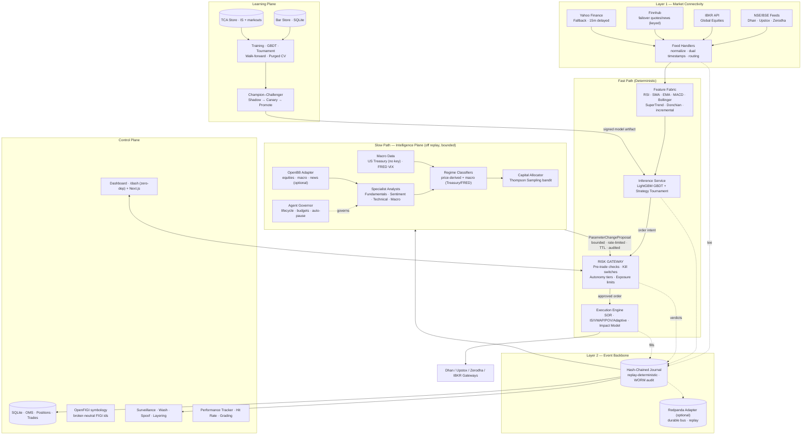

# Architecture — Helios Capital / Enterprise AI Trading Assistant

**This is the canonical architecture document — the single source of truth about
what this application is and what it actually does.** It states what is **built
today** first, then — clearly labeled — the **target-state** the design migrates
toward.

- **Built today** = in the codebase, wired, tested. Everything in §1–§7.
- **Target-state (not built)** = the institutional north-star (Rust/Aeron/QuestDB/
  ClickHouse/K8s). Summarized in §9 with a status matrix in §8; the full design
  deep-dive lives in [`TARGET_ARCHITECTURE.md`](./TARGET_ARCHITECTURE.md), which
  is a *design appendix* to this document, not a description of current state.

If the two ever disagree about what exists, **this document wins.**

---

## 1. What it is

An AI-assisted trading platform for Indian + international markets with two
co-existing faces over one backend:

1. **Institutional event-sourced pipeline** — deterministic, journaled,
   replayable: `bars → strategy → risk gateway → broker → positions`, every event
   teed to a hash-chained JSONL journal. **Backtest ≡ replay ≡ live** is the
   property the whole design rests on.
2. **Product REST surface + UIs** — a FastAPI recommendation/broker/learning/
   market-data API, a Next.js frontend (`frontend/`), and a zero-dependency
   operator dashboard at `GET /dash`.

**Stack today:** Python 3 + FastAPI + SQLAlchemy async over **SQLite**
(`trading_bot.db`, `market_data.db`) + hash-chained JSONL journal. CPU-only,
free/OSS by mandate. ~281 tests. Phases 0–5 + Layer 6 + public-API enrichment
built.

### Core principles (invariants — do not violate)

- **LLMs are banned from the order path.** The fast path is a deterministic GBDT
  (LightGBM, fixed seed → byte-identical booster). LLMs live only in the slow
  path as bounded *parameter advisors*.
- **The risk gateway is the sole order boundary.** No order reaches a broker
  without an APPROVED `RiskVerdict`. Fail-closed.
- **Determinism is a contract.** Same config + same bars → bit-identical
  intents/verdicts/orders/fills. No wall-clock/RNG/I-O in the decision function.
- **The slow path can never block or break the fast path.** Every slow-path
  callback is sandboxed; a crash is swallowed + counted; trading continues on
  last-known-good / TTL-decayed parameters.
- **Slow-path writes are asymmetric.** Tightening auto-applies; loosening needs
  human approval. A hallucinating analyst can only make the system *safer*.

---

## 2. High-level diagram (as built)



---

## 3. The event-sourced pipeline (fast path)

Session assembler: `engine/runner.py::PaperSession` wires
`clock → bus → strategy → gateway → approver → broker → tracker → tca`
(+ optional slow path). `run()` replays bars once; `replay_from_journal()`
rebuilds a bit-identical session from journaled bars alone.

**Event streams** (`core/events.py`): `md.bars`, `md.ticks`, `signal.intents`,
`risk.verdicts`, `exec.orders`, `exec.order_updates`, `exec.fills`,
`oms.positions`, `ctl.params`, `ctl.param_proposals`, `ctl.kill`,
`ctl.approval_requests`, `ctl.approval_decisions`. Timestamps are ns UTC; clocks
are injected (`SimClock`/`LiveClock`) so runs reproduce.

- **Feature fabric** (`features/fabric.py`) — 22 features (13 indicators + 9
  tournament votes), incremental, no lookahead; shared with `learning/strategies.py`
  → zero train/live skew.
- **Inference** (`engine/inference.py`) — pure function; LightGBM GBDT, fixed seed,
  byte-identical booster. Signed model artifact (`learning/artifact.py`,
  `model_id = "model-"+sha[:12]`).
- **Risk gateway** (`risk/gateway.py`) — 9 pre-trade checks, kill switches K1–K4,
  fail-closed; reserves signed qty of approved-but-unfilled orders (F1); consumes
  `ctl.params` as effective-limit overrides; exposure sums iterate sorted symbols
  (determinism).
- **Autonomy tiers** (`risk/tiers.py`) — untrusted/large orders → T3; releases only
  if `tier ≤ auto_release_max_tier`, else emits `ApprovalRequest`; `AutoApprover`
  stands in for a human headless. `trusted` set empty by default.
- **Execution** (`execution/`) — SOR health-scored broker selection + failover,
  Almgren-Chriss impact model, IS/VWAP/POV/Adaptive algos.
- **TCA** (`tca/`) — implementation-shortfall decomposition + markouts at +1/+5/+30
  bars.

---

## 4. Slow path — bounded intelligence (off the replay path)

Strategic adaptation on seconds-to-hours cadence. **Power:** bounded parameter
control. **Prohibition:** can never emit, modify, or cancel an order. Everything
here reaches the gateway only through one typed boundary.

- **`ParameterController`** (`slowpath/params.py`) — the slow path's *only* write
  interface. Bounds (min/max, max step), direction asymmetry (tighten auto /
  loosen held for human), rate limit, quorum (≥N independent sources), TTL decay
  to baseline.
- **Price regime classifier** (`slowpath/regime.py`) — pure function of the bar
  stream (stays replay-deterministic); tightens on realized-vol spikes.
- **Macro regime analyst + service** (`slowpath/macro_regime.py`,
  `engine/macro_regime_service.py`) — off-replay; reads the **US Treasury** yield
  curve (no key) + **FRED** VIX (keyed) and tightens gross exposure on curve
  inversion / high vol. Opt-in background service on a long-lived bus. See §5.
- **LLM analysts** (`slowpath/analyst.py`, `personas.py`) — provider-agnostic
  (`slowpath/providers.py`: OpenAI/Anthropic/Gemini/Groq/Ollama/…); read a news/
  macro item → `EventImpactAssessment` → bounded proposal. Governed by
  `slowpath/governance.py` / `orchestrator.py`.
- **Allocator** (`allocator/bandit.py`) — Thompson Sampling over strategy+param
  arms, promotion via the §7.4 gate. RL execution agent (`allocator/rl_execution.py`)
  is shadow-mode only, never online on the live path.

If the entire slow path dies, trading continues under last-known-good / TTL-decayed
parameters.

---

## 5. Public-API enrichment (built)

Three free public sources, confined to the slow path + product surface — **off the
fast path, order path, and replay.** All key-optional (blank key ⇒ source off, app
unchanged), fail-closed to empty. Full detail:
[`PUBLIC_API_ENRICHMENT.md`](./PUBLIC_API_ENRICHMENT.md).

| Source | Key | Adapter | Role |
|---|---|---|---|
| **US Treasury** yield curve | none | `services/macro_data.py` | 10Y-2Y spread; inversion = stress precursor |
| **FRED** | free | `services/macro_data.py` | VIXCLS implied vol + series |
| **OpenFIGI** | keyless (key raises limit) | `services/openfigi_symbols.py` | broker-neutral FIGI id — removes cross-broker symbol skew |
| **Finnhub** | free | `services/finnhub_provider.py` | market-data failover tier (broker→Finnhub→Yahoo) + news sentiment |

The macro analyst fuses curve spread + VIX into `{None, stress, crisis}` and emits
**tighten-only** `risk.max_gross_exposure` proposals (stress→60%, crisis→50% of
baseline; capped at one max step, deeper cuts ratchet). REST:
`/api/v1/slowpath/macro`, `/symbology/{ticker}`, and the macro service
`status`/`start`/`stop`/`poll`/`simulate`.

---

## 6. Runtime, data flow, storage

```
Browser → Next.js (dashboard/brokers/training/performance/screener/monitor)
  → visibility-aware polling hooks → REST → FastAPI (app.main:app)
    → services/* → broker_adapters.* → market_data (Finnhub/Yahoo fallback)
    → SQLAlchemy → SQLite (broker_accounts, recommendations, trades, risk_limits)
    → hash-chained event journal (replay-deterministic)
  → JSON response → memoised, hash-dedup'd re-render
```

**Stores (today):** SQLite `trading_bot.db` (OMS/trades/recs/brokers), SQLite
`market_data.db` (OHLC bar store), JSONL hash-chained journal (source of truth for
replay), SQLite TCA store. Redpanda/QuestDB/ClickHouse/Postgres/Qdrant are optional
adapters behind opt-in deps (target-state — §9).

**DB schema (SQLite):** `users`, `broker_accounts` (encrypted creds + token expiry),
`trade_recommendations`, `trades`, `risk_limits`, `market_regimes`.

**Polling cadences:** health once; watchlist/intraday 20s; recs/history/accounts/
risk 60s; performance 120s; training status 2s. Polls pause on hidden tab and abort
in-flight requests.

---

## 7. Security model (today)

- **Credentials:** Fernet (AES-128-CBC + HMAC) encryption at rest; masked in API
  responses.
- **Risk gateway:** the order boundary; kill switch < 1s to halt all trading.
- **Broker isolation:** execution router never routes real orders to paper accounts.
- **Approval flow:** every order preview → confirm; LIVE orders get a distinct
  confirmation.
- **Journal:** hash-chained, tamper-evident, verified by
  `scripts/verify_audit_chain.py`.
- **Brokers:** Dhan, Zerodha, Upstox, AngelOne, ICICI Breeze (token-based, SEBI
  06:00 IST daily expiry) + IBKR (Gateway/TWS, no API key).

---

## 8. Built vs planned — status matrix

| Concern | Built today | Target-state (§9) | Status |
|---|---|---|---|
| Fast-path language | Python (deterministic, pure fn) | Rust | 🟡 planned |
| Decision model | LightGBM GBDT, byte-identical | same | ✅ built |
| Risk gateway | Python module, fail-closed | Rust, sole credential holder | ✅ built (Python) |
| Hot-path messaging | in-process `MemoryBus` | Aeron (µs IPC) | 🟡 planned |
| Durable event bus | JSONL journal (+ optional Redpanda adapter) | Redpanda | ✅ journal / 🟡 Redpanda |
| Tick/bar store | SQLite `market_data.db` | QuestDB | ✅ SQLite / 🟡 QuestDB |
| TCA/audit analytics | SQLite TCA store | ClickHouse | ✅ SQLite / 🟡 ClickHouse |
| OMS / positions | SQLite | PostgreSQL | ✅ SQLite / 🟡 Postgres |
| Vector memory | — | Qdrant + knowledge graph | 🔴 not built |
| Slow-path LLMs | provider-agnostic, bounded proposals | frontier models + citations | ✅ built |
| Macro/enrichment data | Treasury/FRED/OpenFIGI/Finnhub | + paid vendors | ✅ built |
| Orchestration | single-process FastAPI + asyncio | Kubernetes (slow path only) | 🟡 planned |
| Dashboards | `/dash` (zero-dep) + Next.js | same + richer approvals | ✅ built |

✅ built · 🟡 partial / adapter exists behind opt-in dep · 🔴 not built

---

## 9. Target-state (NOT built — north-star)

The institutional target-state is a single-host hot path in **Rust** (feed
handlers, feature fabric, inference, risk gateway, execution) over **Aeron**
shared-memory IPC, with **Redpanda** as the durable replayable log, **QuestDB**
ticks, **ClickHouse** TCA/audit, **PostgreSQL** OMS, **Qdrant** + a knowledge graph
for slow-path retrieval, and the risk gateway as the sole broker-credential holder.
Slow path + control plane on **Kubernetes**; hot path on pinned VMs / bare metal
(Mumbai now, exchange colo at the DMA stage).

**None of that is in the codebase today** — SQLite/in-process is the reality, and
the adapters that exist (Redpanda/QuestDB/…) are optional and off by default. The
full design rationale, latency budgets, failure-mode analysis, black-swan plan, and
phased migration live in [`TARGET_ARCHITECTURE.md`](./TARGET_ARCHITECTURE.md) (16
sections) — treat it as the **design deep-dive / roadmap appendix** to this
document, not as a statement of current state.

**Honest latency caveat:** Zerodha retail tier = 50–300 ms venue latency +
conflated snapshots; any sub-ms numbers are internal-pipeline only until DMA/colo.

---

## 10. Run & test

```powershell
.\start.ps1                       # backend + dashboard -> http://127.0.0.1:8000/dash
venv\Scripts\python.exe -m uvicorn app.main:app --app-dir backend --port 8000
venv\Scripts\python.exe -m pytest          # ~281 tests (tests/ dir)
```

Dashboard `/dash` · API docs `/docs` · health `/health`. Import root is `app.*`
with `backend/` on `sys.path`.

**Doc map:** phase build records `PHASE0_REVIEW.md`–`PHASE5_IMPLEMENTATION.md`,
`LAYER6_DASHBOARDS.md`; enrichment `PUBLIC_API_ENRICHMENT.md`; REST `API.md`;
end-user `USER_GUIDE.md`; target-state deep-dive `TARGET_ARCHITECTURE.md`.
