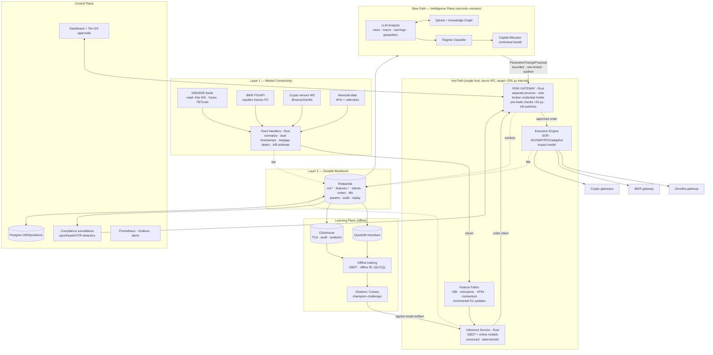
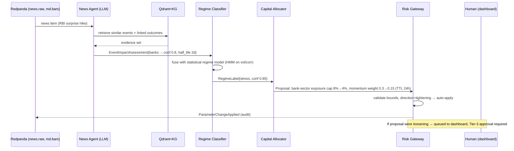

# Institutional Target-State Architecture — Enterprise Trading Platform

**Status:** Design review draft v1.0 · 2026-06-10
**Scope:** Complete architectural transformation of the Enterprise AI Trading Assistant into an institutional-grade autonomous trading platform.
**Audience:** CTO / Head of Trading Technology review.

---

## 1. Executive Summary

The current system is an LLM-agent pipeline wired to retail broker APIs with a human-approval gate. As designed, it cannot manage institutional capital: LLM agents sit in the trade decision path (non-deterministic, multi-second latency, non-replayable), risk management is a peer "agent" rather than an unbypassable boundary, the RL loop performs online weight updates on live PnL (catastrophic-forgetting and reward-hacking exposure), there is no event log, no tick store, no TCA, no compliance layer, and no disaster recovery. Of the described system, roughly 5% exists in code (4 backend stubs, 2 test scripts) — which is the single best fact in this review: there is no legacy to migrate, so the platform can be built correctly from first principles.

The redesign splits the platform into a **deterministic fast path** (feed handler → feature fabric → GBDT inference → risk gateway → execution, all sub-millisecond internally, Rust) and an **LLM slow path** (news/macro/regime intelligence that may only adjust *bounded parameters* — risk limits, strategy weights, regime labels — never individual orders). Every event flows through a replayable log (Aeron for the hot path, Redpanda for durability), making backtest, shadow trading, and live trading the *same code path*. Risk becomes a separate Rust process that exclusively holds broker credentials — orders physically cannot reach a venue without passing it. Learning is offline-first (offline RL + contextual-bandit capital allocation) with shadow → canary → champion-challenger promotion, never direct online policy updates.

**Honest constraint up front:** true sub-millisecond tick-to-trade requires exchange membership, colocation, and native protocols (NSE TBT/NNF). Via Zerodha's retail API, order placement costs 50–300 ms upstream and market data arrives as conflated snapshots — no internal architecture changes that. The design therefore targets: (a) a sub-millisecond *internal* decision loop that is venue-agnostic, (b) graceful feature degradation by feed tier, and (c) a clean upgrade path to DMA/colo without re-architecture. Strategies must be chosen to match the latency tier actually available — intraday/swing alpha now, microstructure alpha only after DMA.

---

## 2. Current Architecture Audit

Severity: 10 = capital-destroying / disqualifying for institutional use.

| # | Subsystem | Bottleneck | Root Cause | Impact | Sev | Recommended Fix |
|---|-----------|------------|------------|--------|-----|-----------------|
| 1 | **Decision path (Multi-Agent LLM)** | Serial LLM round-trips (Technical→News→Macro→Risk→Capital→Decision) cost 5–30 s per recommendation; outputs non-deterministic | LLMs placed in the trade-decision critical path | Alpha decays before order exists; identical inputs → different trades; impossible to replay/audit; per-decision token cost scales with trade count | **10** | Split fast/slow path. Trade decisions: deterministic GBDT/online models in Rust (<100 µs). LLMs demoted to slow-path parameter advisors (§5, §6) |
| 2 | **Risk management ("Risk Agent")** | Risk is a peer agent in the same process/prompt chain as alpha agents | Risk modeled as advice, not as a boundary | Any orchestrator bug, prompt drift, or agent failure bypasses risk; one bad loop can send unlimited orders | **10** | Standalone Rust risk gateway; sole holder of broker credentials; every order passes pre-trade checks in-process; kill switches (§8) |
| 3 | **RL loop (online weight updates from PnL + user feedback)** | Continuous online updates on non-stationary, sparse, delayed reward | No off-policy evaluation, no shadow stage, reward = raw PnL | Catastrophic forgetting on regime change; feedback loops (model trades → moves its own reward); reward hacking (e.g., learns to avoid stop-losses by widening them); user feedback poisons policy | **9** | Offline RL (IQL/CQL) + contextual bandit allocation; shadow → canary → champion/challenger; risk-adjusted reward with turnover penalty (§7) |
| 4 | **Market data ingestion** | Single broker WebSocket (Kite) into Python asyncio; conflated snapshots ~1/sec, 3k-instrument cap per connection; no sequencing, no raw capture | Broker SDK treated as a market-data platform | Gaps undetected; no replay → no backtest parity; GC pauses stall the only feed; microstructure features (VPIN, queue position) impossible from snapshot data | **9** | Dedicated feed handlers (Rust) with normalization, sequence-gap detection, A/B feed arbitration where available, raw capture to log; feed-tier-aware feature fabric (§4, §5) |
| 5 | **Approval workflow (human approves every trade)** | Human latency: minutes-to-never | "Mandatory human approval" as the only safety mechanism | Intraday alpha gone before approval; approval fatigue → rubber-stamping (worse than rules); blocks scaling to multi-strategy | **8** | Dynamic autonomy tiers (Tier 1 auto within hard limits / Tier 2 timeout-approval / Tier 3 human-required) — human attention spent only where it has value (§8.4) |
| 6 | **Execution** | Direct market/limit orders via broker REST; no SOR, no execution algos, no TCA, no slippage model | Execution treated as an API call, not a discipline | Pays full spread + impact; no measurement → no improvement; single broker = single point of failure | **8** | Execution stack: pre-trade impact model, algo suite (IS/VWAP/POV/adaptive), multi-broker SOR, post-trade TCA in ClickHouse (§10 walkthrough, Task 4 sections) |
| 7 | **Storage** | Postgres for everything transactional; ChromaDB (embedded, single-node) for "market regimes"; SQLite bar store; Redis as price cache | No separation of tick store / analytics / OMS state | Postgres can't ingest tick volumes; Chroma has no HA/SLA and similarity ≠ causality for regimes; no time-series engine → no fast TCA/backtests | **7** | QuestDB (ticks/bars), ClickHouse (TCA/analytics/audit queries), Postgres (OMS/reference only), Qdrant (vectors, slow path only), Redis/Dragonfly (hot state) (§11) |
| 8 | **Event transport** | None — components call each other directly (function calls / REST) | No event backbone | No replay, no audit trail, no decoupling; any consumer failure back-pressures the producer; "what happened at 09:47:13?" is unanswerable | **9** | Aeron (hot path IPC) + Redpanda (durable log, replay, slow path) (§4 Layer 2) |
| 9 | **Compliance** | Entirely absent | Not designed for | SEBI algo-trading framework non-compliance (strategy registration, order tagging, audit retention); no surveillance (spoofing/wash/OTR); regulatory and broker-termination risk | **9** | Dedicated compliance layer: pre-trade rule enforcement in risk gateway, post-trade surveillance jobs, WORM audit log, 7-year retention (§9) |
| 10 | **Observability / DR** | No metrics, no tracing, no audit log, no failover; Windows dev box is the deployment target | Prototype posture | Silent failures during market hours; no trade reconstruction; broker/exchange outage = undefined behavior | **9** | Prometheus/Grafana + order-lifecycle tracing + WORM audit; documented DR with RTO/RPO per component (§13) |
| 11 | **RAG (ChromaDB historical event context)** | Vector similarity over news embeddings used as decision context | Embedding similarity conflated with causal relevance | "Similar" past events with opposite outcomes retrieved confidently; embedded DB in decision path adds 50–500 ms | **7** | Move to slow path only; Qdrant + knowledge graph with typed event→outcome edges; LLM analyst consumes it, fast path never does (§6) |
| 12 | **Implementation reality** | Described system ≈ docs; code = 4 stubs (`auth.py`, `vector_db.py`, `trade.py`, `notification_service.py`) | Part 2 is early | Audit above is of the *design*; nothing is sunk cost | — | Treat as greenfield. Build target state directly; skip interim throwaway (§16) |

**Stress-event behavior of current design (Task 8 baseline):** during a flash crash, LLM agents would be reasoning about stale snapshots with multi-second latency, the Risk "Agent" could be skipped by an orchestrator exception, Redis would serve stale prices, the human approver becomes the bottleneck exactly when seconds matter, and there is no cancel-on-disconnect, no kill switch, and no de-risk ladder. The current design's stress behavior is **undefined**, which for a trading system means **capital-destroying**.

---

## 3. New High-Level Architecture

Five planes, two speeds, one log.

1. **Market Connectivity Plane (Layer 1).** Per-venue/per-broker feed handlers normalize everything (ticks, depth, trades, news, macro) into one internal event schema with dual timestamps (exchange + local receive, nanosecond). A/B feed arbitration and gap detection where the venue supports it. Order gateways are the mirror image on the way out.
2. **Event Backbone (Layer 2).** Two-tier: **Aeron** shared-memory IPC for the hot path (feed → features → models → risk → execution, single host, microseconds) and **Redpanda** as the durable, replayable system-of-record bus for everything else (slow path, persistence, audit, backtest replay).
3. **Feature & Decision Plane (Layer 3 + Fast Path).** In-memory feature fabric computes microstructure and momentum features incrementally per tick (O(1)/O(k) updates). Deterministic models (GBDT, online linear/logistic) score in <100 µs in Rust. Output is an *order intent*, never an order.
4. **Risk & Execution Plane.** The Rust **risk gateway** is a separate process and security boundary — the only component holding broker credentials. Pre-trade checks in <50 µs; portfolio-level checks async; kill switches at four escalation levels. Behind it, the execution engine runs SOR + execution algos and emits fills back onto the log.
5. **Intelligence Plane (Slow Path).** LLM agents (news, macro, earnings, geopolitics) + vector DB + knowledge graph run on seconds-to-minutes cadence. Their *only* write interface is `ParameterChangeProposal` events: regime label, strategy weight deltas, risk-limit tightening, capital allocation. Every proposal is bounded, rate-limited, validated by the risk gateway, and audited. They cannot emit orders. **Loosening** risk limits always requires human approval; tightening can be automatic.

Cross-cutting: every event (tick, feature snapshot hash, intent, risk verdict, order, ack, fill, parameter change, model version) lands on Redpanda → ClickHouse/QuestDB. Backtests replay the same log through the same fast-path binary — *backtest/live parity is an architectural property, not a hope*.

---

## 4. Mermaid Architecture Diagram



---

## 5. Fast Path Design

**Purpose:** every decision that results in an order. **Requirements:** deterministic (same inputs → same output, always), explainable (feature attributions logged per decision), p99 < 1 ms internal.

### 5.1 Why LLMs must never sit in the critical execution path

1. **Latency:** LLM p50 is 1–10 s, p99 worse; intraday alpha half-life is often seconds. The trade is dead before the token stream ends.
2. **Non-determinism:** identical market state can produce different orders. That is unacceptable for risk control, for regulators (MiFID II RTS 6 requires algos be tested and their behavior reproducible; SEBI requires registered, identifiable strategy behavior), and for debugging.
3. **Non-replayability:** you cannot re-run yesterday's incident if the decision function is a sampled distribution behind a third-party API.
4. **Hallucination under distribution shift:** precisely during black swans — when the model has never seen the input — an LLM's failure mode is *confident fabrication*, the worst possible property at the worst time.
5. **Availability coupling:** an external API outage becomes a trading outage.
6. **Cost scaling:** token cost × decisions/day is a tax on every trade; GBDT inference is effectively free.

LLMs are excellent *analysts* and terrible *executors*. They write to parameters, slowly and boundedly; they never write to orders.

### 5.2 Components and latency budget

| Component | Implementation | Budget (DMA tier) | Notes |
|---|---|---|---|
| Feed decode + normalize | Rust feed handler | 5–20 µs | zero-copy parse, pre-allocated buffers |
| Feature update | Rust, incremental | 20–50 µs | all features O(1)/O(k) per tick (§ Layer 3) |
| Model inference | Rust service, GBDT compiled | 30–80 µs | LightGBM → ONNX/treelite-style codegen; no Python in path |
| Risk pre-trade checks | Rust risk gateway | 10–50 µs | lock-free limit tables, atomics |
| Order encode + route | Rust gateway | 10–20 µs | persistent sessions, pre-built templates |
| **Internal total** | | **~100–250 µs p50, <1 ms p99** | |

Retail-broker tier: same pipeline, but venue round-trip is 50–300 ms (HTTPS + broker OMS), so internal target relaxes to p99 < 5 ms and Python (NumPy/Polars + native LightGBM) is acceptable for Phase 1–2 (§16). The internal pipeline is built clean anyway: it future-proofs for DMA and gives precise timestamps for TCA either way.

### 5.3 Models

- **Primary:** LightGBM/XGBoost classifiers/regressors per strategy: P(favorable move over horizon h) and expected-return quantiles. Chosen over deep nets: tabular dominance, monotonic constraints (e.g., "wider spread never increases buy aggression"), native feature attribution (per-decision SHAP-style logging → explainability requirement satisfied), microsecond inference.
- **Online layer:** lightweight online logistic regression / EWMA recalibration on top of GBDT scores (Platt-style), updated intraday with strict learning-rate caps — adapts calibration, not structure.
- **Serving:** models are versioned, signed artifacts. Inference service memory-maps the model, exposes Aeron request channel. Hot-swap by atomic pointer switch; every decision logs `(model_id, feature_vector_hash, score, top_attributions)`.
- **Determinism rule:** no wall-clock, no RNG, no I/O inside the decision function. Inputs: event + feature state only.

---

## 6. Slow Path Design

**Purpose:** strategic adaptation on seconds-to-hours cadence. **Power:** bounded parameter control. **Prohibition:** can never emit, modify, or cancel an order.

### 6.1 Agents (LLM, frontier models)

| Agent | Inputs | Output (typed, bounded) |
|---|---|---|
| News intelligence | news stream, filings, Qdrant retrieval | `EventImpactAssessment{symbols, direction, confidence, half_life}` |
| Macro analyst | RBI/Fed calendars, prints vs consensus | `MacroStateUpdate{rates_outlook, liquidity_state}` |
| Earnings interpreter | transcripts, results vs estimates | per-symbol drift/vol expectations |
| Geopolitical monitor | curated feeds | `TailRiskAlert{severity, affected_sectors}` |
| Regime classifier | all above + realized vol/corr/breadth from fast path | `RegimeLabel ∈ {trend, chop, stress, crisis}` + confidence |

Supporting memory: **Qdrant** for embeddings (replaces Chroma: HA, real filtering, scales) + a **knowledge graph** (typed edges: event →[preceded]→ outcome, company →[supplier_of]→ company) so retrieval is causal-ish, not just cosine-similar. LLM analysts must cite retrieved evidence IDs in their output — the citation list is stored with the proposal (auditability).

### 6.2 The only write interface: `ParameterChangeProposal`

```json
{
  "proposal_id": "uuid",
  "source_agent": "regime_classifier",
  "parameter": "strategy_weight.momentum_v3",
  "current": 0.30, "proposed": 0.15,
  "ttl": "4h",
  "evidence": ["news:8821", "kg:edge:4410", "vol:realized_5m=4.2sigma"],
  "rationale": "regime shift trend→stress; momentum alpha decays in stress"
}
```

Enforcement (in the risk gateway, not in the agent):
- **Bounds:** each parameter has a hard schema: min/max, max step per change (e.g., strategy weight Δ ≤ 0.25/hour), max change frequency.
- **Direction asymmetry:** risk-*tightening* proposals (lower limits, cut weights) auto-apply within bounds; risk-*loosening* proposals always queue for human approval. This makes the slow path fail-safe: a hallucinating LLM can make the system too conservative, never too aggressive.
- **TTL:** every change expires back to baseline unless renewed — a stuck agent cannot leave the system in a drifted state.
- **Rate limit + quorum:** large regime changes (e.g., crisis label) require agreement of ≥2 independent signals (LLM assessment + statistical regime model) before capital allocation shifts.

### 6.3 Orchestration



The fast path never waits on any of this. If the entire slow path dies, trading continues under last-known-good (or TTL-decayed baseline) parameters.

### 6.4 Implemented external data sources (public-API enrichment)

The §6.1 "Macro analyst" and "Regime classifier" rows are realized today by concrete adapters over **free public APIs**, wired exactly through the §6.2 `ParameterChangeProposal` boundary. All are off the deterministic fast path (real wall clock, network), key-optional (blank key ⇒ source disabled, app unchanged), and fail-closed to empty — a macro outage changes nothing. See `docs/PUBLIC_API_ENRICHMENT.md`.

| Source | Key | Adapter | Role |
|---|---|---|---|
| **US Treasury** daily par-yield curve | none | `services/macro_data.py` | 10Y-2Y spread; inversion = stress precursor |
| **FRED** (Federal Reserve) | free | `services/macro_data.py` | VIXCLS implied vol + other series |
| **OpenFIGI** (Bloomberg symbology) | keyless (key raises rate limit) | `services/openfigi_symbols.py` | broker-neutral FIGI id — removes cross-broker symbol skew |
| **Finnhub** | free | `services/finnhub_provider.py` | market-data failover tier (broker→Finnhub→Yahoo) + news sentiment (analyst evidence) |

The **macro regime analyst** (`slowpath/macro_regime.py`) fuses the curve spread + VIX into `{None, stress, crisis}` and — on stress — emits a **tighten-only** proposal on `risk.max_gross_exposure` (stress→60%, crisis→50% of baseline; capped at one `max_step_frac` so it applies from baseline in one poll, deeper cuts ratchet). It is the concrete macro counterpart to the pure-price `RegimeClassifier`, satisfying the §6.2 direction-asymmetry rule: it can only make the system more conservative. The **macro regime service** (`engine/macro_regime_service.py`) hosts it on a long-lived bus + `ParameterController` so proposals auto-apply and TTL-decay to baseline; opt-in, never auto-run. This is the ≥2-independent-signals path of §6.2 quorum (statistical price regime + external macro) made real.

---

## 7. RL System Design

### 7.1 Online learning risks → mitigations

| Risk | Mechanism in current design | Mitigation in target |
|---|---|---|
| Catastrophic forgetting | continuous weight updates on recent PnL | no live weight updates; training offline on full history with regime-stratified sampling; new models are *new versions*, old champion retained and restorable |
| Feedback loops | model's own trades move price → reward reflects own impact | train on counterfactual mid-price markouts, not raw fill PnL; cap participation (POV ≤ limits) so self-impact stays small; impact model subtracts estimated own-impact from reward |
| Reward hacking | raw PnL reward | risk-adjusted reward with explicit penalty terms (below); reward components logged and audited; hard action-space constraints (policy literally cannot exceed size/loss bounds — enforced by risk gateway, not by reward) |
| Overfitting | unconstrained continuous fit | walk-forward + purged k-fold CV (embargoed, López de Prado); deflated Sharpe ratio for selection; min-sample gates before promotion |
| Human-feedback poisoning | user feedback directly updates weights | feedback only labels data for offline review; never a gradient signal |

**Reward function (per strategy, per period):**

r_t = ΔNAV_t − λ·σ̂_t(ΔNAV) − κ·Turnover_t − c·Costs_t − β·DD_t

with λ calibrated so the optimum approximates max-Sharpe; κ penalizes churn (anti-overtrading); DD_t = incremental drawdown. All coefficients versioned; changes to reward = new experiment, never silent.

### 7.2 Algorithm comparison and recommendation

| Algorithm | Fit for trading | Verdict |
|---|---|---|
| DQN | discrete actions; overestimation bias; brittle under non-stationarity | No — fragile exactly where markets are hard |
| PPO | on-policy → needs fresh interaction data; stable but sample-hungry; live interaction = live risk | Only inside simulators; never online on capital |
| A2C/A3C | weaker PPO | No |
| SAC | off-policy, continuous actions (position sizing), entropy regularization | Best *online-family* candidate for sizing — but still only in sim/shadow |
| **Offline RL (IQL/CQL)** | learns from logged data without live exploration; conservatism penalizes out-of-distribution actions | **Yes — primary.** CQL objective adds α·E_s[log Σ_a e^{Q(s,a)} − E_{a∼μ}Q(s,a)] to TD loss, pushing down Q for unseen actions: exactly the conservatism trading needs |
| **Contextual bandit (Thompson sampling)** | no credit-assignment-over-trajectories problem; allocates capital across strategies given regime context | **Yes — the production allocator** |

**Production architecture (three layers, decreasing autonomy of "RL"):**
1. **Signal layer:** supervised GBDT (not RL at all) — predicts returns/probabilities. Most of the edge lives here.
2. **Allocation layer:** contextual bandit over strategies: context = regime label + realized vol + recent strategy Sharpe; action = capital weights (bounded simplex); reward = next-period risk-adjusted strategy return. Thompson sampling with conservative priors. This is where "learning which agent/strategy to trust" — the legitimate kernel of the current RL idea — actually belongs.
3. **Policy layer (research):** offline RL (IQL) trained on logged (state, action, markout) for execution tactics (passive vs aggressive, slice sizing). Ships only through the safe-learning pipeline below.

### 7.3 Credit assignment

Decompose realized shortfall per trade so blame lands on the right component. Let p_d = decision price (mid at signal time t_d), p_a = arrival price (mid when order reaches venue, t_a), p̄_f = average fill price, q* = intended qty, q = filled qty, p_T = mid at evaluation horizon T.

**Implementation shortfall (Perold) decomposition:**

IS = (p̄_f − p_d)·q + (p_T − p_d)·(q* − q)
   = **Delay cost** (p_a − p_d)·q        ← latency: broker, network, human approval
   + **Execution cost** (p̄_f − p_a)·q   ← spread + market impact (execution quality)
   + **Opportunity cost** (p_T − p_d)·(q* − q) ← unfilled quantity

Attribution rules:
- **Bad signal:** markout α_h = E[mid_{t_d+h} − mid_{t_d}] · side, measured at decision time over horizons h ∈ {1s, 10s, 1m, 5m, 30m}. If α_h ≤ 0 systematically, the *signal* is bad regardless of execution. Computed against mid (not fills) → immune to spread noise.
- **Broker/venue latency:** (p_a − p_d) split by timestamps t_signal → t_intent → t_risk_ok → t_sent → t_broker_ack → t_exchange_ack (all logged, ns precision). Each hop's price drift is separately attributable; broker OMS latency = t_exchange_ack − t_sent minus exchange processing.
- **Human delay (Tier 2/3):** delay-cost sub-term over [t_notified, t_approved]; reported per user — makes the cost of the approval workflow *visible in rupees*, informing tier thresholds.
- **Slippage vs noise:** microstructure noise (bid-ask bounce) handled by using microprice/mid for all marks; significance of impact estimates tested against the square-root impact baseline ΔP ≈ Y·σ·√(Q/ADV) — residuals beyond it flag venue/algo problems rather than size.

### 7.4 Safe learning pipeline

```
offline train → offline eval (OPE) → shadow (live data, paper fills) → canary (5% capital) → champion
```

1. **Offline evaluation:** walk-forward, purged/embargoed CV; deflated Sharpe (corrects for #trials); doubly-robust off-policy estimate for policy-shaped changes: V̂_DR(π) = (1/n) Σᵢ [ V̂(sᵢ) + ρᵢ·(rᵢ − Q̂(sᵢ,aᵢ)) ], ρᵢ = π(aᵢ|sᵢ)/μ(aᵢ|sᵢ), with importance weights clipped.
2. **Shadow:** challenger consumes the live event stream, emits intents into a fill simulator (queue-position + impact model on captured book states). Runs ≥ 4 weeks or ≥ N=200 trades, whichever later.
3. **Canary:** 5% of strategy capital, same risk gateway limits scaled down. Auto-rollback triggers: drawdown > 2× champion's, slippage > model + 50%, any hard-limit hit.
4. **Champion–challenger promotion gate:** probabilistic Sharpe ratio PSR(challenger > champion) ≥ 0.95 on overlapping live period; max-DD within mandate; TCA not worse. Promotion = config change + audit event; old champion kept warm for instant rollback.
5. **Counterfactual testing:** weekly replay of the full event log through both models; divergence report (decisions that differ, with feature attributions) reviewed before any promotion.

---

## 8. Risk Engine Design

### 8.1 Separate security boundary

- **Isolated process** (own host or own container with dedicated cores), own repo, own deploy pipeline, own on-call. Releases independent of strategy code.
- **Rust.** Why: memory safety without GC (no GC pause in the order path — Java/Go can stall 1–10 ms at the worst moment), fearless concurrency for lock-free limit tables, `#![forbid(unsafe_code)]` in the checking core, exhaustive `match` on order states (compiler-enforced completeness), and a small attack surface.
- **Unbypassable by construction, not by convention:** broker API keys/sessions exist *only* inside the risk gateway (separate vault scope, separate cloud account/VPC). Strategy code has no network route to any broker. The only way to trade is `OrderIntent` → gateway. Egress firewall on strategy hosts blocks broker endpoints outright.
- Dual-instance hot-standby with shared journal; standby holds sessions warm but dark.

### 8.2 Risk controls (pre-trade, synchronous, target <50 µs)

| Control | Check | Typical default |
|---|---|---|
| Position limits | per-symbol net/gross qty and notional post-order | per-symbol ≤ 2% NAV |
| Exposure limits | gross/net portfolio, per-sector, per-strategy notional | gross ≤ 150% NAV, sector ≤ 15% |
| Fat-finger | order size vs ADV and vs 30-day avg order; price collar vs LTP | size ≤ 1% ADV; price within ±3% of LTP |
| Rate limits | orders/sec per strategy, OTR (order-to-trade ratio) | NSE OTR penalties start mattering — throttle well below |
| Margin | SPAN+exposure margin pre-check vs available | ≥ 25% buffer maintained |
| Liquidity | order ≤ x% of visible depth within 5 bps; reject in illiquid names | ≤ 20% of top-3-level depth |
| Self-trade prevention | would-cross against own resting order → cancel-newest | always on |

**Asynchronous (portfolio, 100 ms–1 s cadence):** parametric + historical VaR (95/99) with CVaR limit; factor/beta exposure caps; pairwise-correlation concentration (effective number of independent bets); drawdown ladders — −2% day → halve all new sizes; −4% → Tier 1 suspended (no new entries); −6% → flatten ladder + human page. Breach results are *enforced* by flipping pre-trade limit tables, so the sync path stays microsecond-fast.

### 8.3 Kill switches (escalation levels)

| Level | Action | Trigger / who |
|---|---|---|
| K1 | halt one strategy (no new intents accepted) | auto: strategy DD/slippage anomaly; or one click |
| K2 | cancel all resting orders, block new entries platform-wide | auto: feed integrity failure, position mismatch broker-vs-internal; or risk officer |
| K3 | de-risk ladder: reduce positions passively → aggressively to flat | auto: black-swan triggers (§14); or risk officer |
| K4 | drop broker sessions (cancel-on-disconnect engaged), platform dark | big red button: physical/dashboard, also auto on risk-gateway self-check failure |

K4 must work when everything else is down: implemented as a tiny independent watchdog process + broker-side cancel-on-disconnect configuration, tested monthly in paper environment.

### 8.4 Dynamic autonomy tiers

| Tier | Mode | Conditions (ALL must hold) |
|---|---|---|
| **1 — Fully autonomous** | execute immediately | liquid instrument (top-N ADV list); order ≤ 0.25% NAV and ≤ 0.5% ADV; all limits ≥ 30% headroom; regime ∈ {trend, chop}; model confidence ≥ threshold; strategy is champion (not canary) |
| **2 — Conditional** | notify human; auto-execute after timeout (e.g., 90 s) unless vetoed; size auto-reduced 50% on timeout-execute | any: order ≤ 1% NAV; limit headroom 10–30%; regime = stress; earnings/event window for symbol; canary strategy |
| **3 — Human required** | no execution without explicit approval; expires worthless after TTL | any: new strategy first 2 weeks; order > 1% NAV; illiquid instrument; regime = crisis; post-K-switch resumption; any risk-loosening parameter proposal; manual override of a risk verdict (requires second approver — four-eyes) |

Escalation rules: tier is computed per-intent by the risk gateway (deterministic function of the table above); any single condition failing a tier pushes the intent down a tier; consecutive Tier-2 vetoes (≥3 in a session) auto-suspend the strategy to Tier 3. De-escalation (crisis→normal) requires both statistical regime model and human confirmation — asymmetric on purpose.

---

## 9. Compliance Architecture

Dedicated layer, two halves: **pre-trade enforcement** (inside risk gateway, synchronous) and **post-trade surveillance** (streaming jobs on Redpanda → ClickHouse).

**Jurisdiction mapping (design targets):**

| Regime | Key obligations engineered for |
|---|---|
| SEBI (primary) | algo strategy registration/approval via broker & exchange; every order tagged with registered algo/strategy ID; broker-level kill switch honored; audit trail retention (≥5 y; we keep 7); OTR limits; no dark-pool equivalent domestically — SOR is broker/exchange only in India |
| RBI | relevant if FX/cross-border capital (LRS limits for individuals; crypto via FIU-registered exchanges, PMLA/KYC obligations) |
| SEC/FINRA (via IBKR, US sleeve) | Rule 15c3-5 Market Access: pre-trade risk controls are a *legal requirement*, not best practice — our risk gateway is the documented control; CAT-compatible event records |
| MiFID II (if EU later) | RTS 6: algo testing, kill functionality, annual self-assessment; RTS 25 clock sync: UTC-traceable, ≤100 µs divergence for HFT-class — our PTP/ns-timestamp design already conforms |

**Real-time enforcement (pre-trade):** self-trade prevention; price collars; restricted/halted-instrument list (synced from exchange notices); position-limit regs (e.g., F&O market-wide position limits); order-rate and OTR throttles; strategy-ID tag mandatory on every order (reject untagged).

**Surveillance detectors (post-trade, streaming; each emits a scored alert, K1-capable on high score):**
- **Wash trading:** matches between accounts/strategies with common ownership; fills with no beneficial-ownership change.
- **Spoofing:** large non-marketable orders with cancel-within-Δt rate > threshold, correlated with own opposite-side executions: score = P(cancel | opposite fill) × size percentile.
- **Layering:** ≥3 stacked price levels one side followed by execution on the other side within window.
- **Momentum ignition / manipulation:** own participation > x% of volume during price acceleration windows.
- **Front-running:** ordering analysis between any signal-access account and platform orders (matters as team grows).

A platform that trades its own book can still produce these patterns *accidentally* (e.g., an execution algo that cancels aggressively can look like spoofing to the exchange). Surveillance is therefore self-protective: detect and fix before the exchange's surveillance does.

**Audit logging:** every event content-hashed and chained (hash(eventₙ) includes hash(eventₙ₋₁)) → tamper-evident; written to ClickHouse + object storage with WORM/retention lock; nanosecond timestamps; full trade reconstruction = deterministic replay of the log (same binary, same output — the parity property again). Regulatory reports (trade files, algo audit) are ClickHouse queries, not archaeology.

---

## 10. Data Flow Walkthrough

**A. Tick → order (fast path, happy path):**
1. `t₀` NSE tick arrives at feed handler; decode, normalize; stamp `ts_exch` (exchange) + `ts_recv` (local, ns via PTP-disciplined clock); sequence-check (gap → mark symbol stale, suppress trading on it). *+15 µs*
2. Publish on Aeron `md` channel; async tee to Redpanda `md.nse.ticks`. *+5 µs*
3. Feature fabric updates incremental state: OBI, microprice, momentum vector, spread EWMA, volume acceleration, VPIN bucket. *+40 µs*
4. Inference service scores active strategies on the new feature vector; momentum_v3 emits `OrderIntent{RELIANCE, BUY, qty, limit, strategy_id, model_id, attributions}`. *+80 µs*
5. Risk gateway: ~15 sync checks (position, exposure, fat-finger, margin, liquidity, STP, rate, compliance tags) → verdict APPROVED, tier computed = 1. *+40 µs*
6. Execution engine: order ≤ 0.4% of 5-bps depth → single IOC limit at microprice+offset; routed to broker gateway with `algo_tag`. *+20 µs*
7. **Internal elapsed ≈ 200 µs.** Venue leg: colo 100–300 µs / retail broker 50–300 ms.
8. Ack + fill return → positions updated (gateway-local, then OMS), fill on Redpanda `exec.fills`; TCA job computes arrival/decision slippage vs impact model; markouts scheduled at 1s/10s/1m/5m.
9. Every artifact of steps 1–8 is on the log; nightly replay verifies determinism (live decisions ≡ replayed decisions).

**B. News → parameter change (slow path):** RBI surprise hike → news agent retrieves precedent via Qdrant/KG → impact assessment (banks −, conf 0.8) → regime classifier fuses with HMM vol/corr model → stress label → capital allocator proposes: bank-sector cap 8%→4%, momentum weight 0.30→0.15, TTL 24 h → risk gateway validates bounds, direction = tightening → auto-apply, audit event, dashboard banner. Elapsed ~20 s. Zero orders touched; the *next* intent simply meets tighter limits.

**C. Fill → learning:** fills + markouts + IS decomposition land in ClickHouse → nightly: TCA report, signal-decay curves per strategy, feature drift (PSI), bandit posterior update for next-day allocation → weekly: walk-forward retrain → shadow → (gate) → canary.

---

## 11. Technology Stack Matrix

| Component | Technology | Why chosen | Alternatives | Trade-offs |
|---|---|---|---|---|
| Feed handlers, feature fabric, inference, risk gateway, exec engine | **Rust** | memory-safe + no GC pauses; µs-predictable; one language across hot path | C++ (faster to hire vets, footguns), Go (GC pauses 0.5–10 ms), Java+Chronicle (JVM tuning tax) | smaller talent pool; slower iteration than Python — mitigated by keeping research in Python |
| Research, training, slow-path services, backtest authoring | **Python** (Polars, LightGBM, PyTorch) | ecosystem; speed of iteration | Julia (ecosystem risk) | never in the order path after Phase 3 |
| Control-plane services (dashboard API, approvals) | Python FastAPI now; Go if team grows | already started; latency-insensitive | Go, TS/Node | fine as-is |
| Hot-path messaging | **Aeron** | shared-memory IPC, single-digit µs, battle-tested in trading | Chronicle Queue (JVM-centric — we have no JVM), raw shared-memory rings (NIH), iceoryx2 | operational learning curve; worth it only on the single-host hot path |
| Durable event bus | **Redpanda** | Kafka API without ZooKeeper/JVM; single binary; p99 publish ~5–15 ms at our scale; strong replay | Kafka (heavier ops, same API), NATS JetStream (weaker ecosystem for replay tooling), Pulsar (operational overkill) | smaller community than Kafka; acceptable |
| Tick/bar store | **QuestDB** | millions rows/s ingest; SQL; designed for ticks; replaces SQLite `market_data.db` | TimescaleDB (richer SQL, ~10× slower ingest), kdb+ (cost), Arctic/Parquet (no live query) | younger ecosystem; mitigated by Redpanda being the true system of record |
| Analytics / TCA / audit queries | **ClickHouse** | columnar scans over billions of events in seconds; cheap retention | BigQuery/Snowflake (egress + latency + cloud lock-in), DuckDB (single-node only — fine for research) | ops effort for cluster; start single-node |
| OMS / positions / reference data | **PostgreSQL** | correctness, FKs, transactions; boring is good here | — | not for ticks, ever |
| Hot state / session cache | **Redis** (Dragonfly if/when throughput demands) | ubiquitous; sub-ms | Dragonfly (faster, multi-threaded; younger), KeyDB | hot-path state actually lives in-process; Redis is for the control plane/dashboard |
| Feature store (training-serving parity) | **Feast** (offline registry) + in-process fabric (online) | declarative parity between training data and live computation | Tecton (cost), homegrown registry | Feast's online store is too slow for µs serving — use it for *definitions/training*, serve from the in-process fabric |
| Vector DB | **Qdrant** | HA, filtering, perf; replaces Chroma | pgvector (simpler, fine at small scale — acceptable interim), Weaviate, Milvus | one more service; slow path only |
| LLMs (slow path) | Frontier API models (function-calling, structured output) | best reasoning per ₹; structured `Proposal` outputs | self-hosted Llama-class (data control vs quality gap) | API dependency tolerable — slow path is not availability-critical |
| Macro / enrichment data (slow path) | **US Treasury** (yield curve, no key) + **FRED** (VIX) + **OpenFIGI** (symbology) + **Finnhub** (quotes/news) over httpx | free tiers; no extra deps; realizes the §6.1 macro/regime + symbology needs today | OpenBB SDK (heavier), paid vendors (Bloomberg/Refinitiv) | key-optional, fail-closed to empty; off the fast path — an outage changes nothing (§6.4) |
| Orchestration (slow path + control plane) | **Kubernetes** (managed) | standard ops, autoscaling for analysts/training | Nomad (simpler, smaller ecosystem) | **never** for the hot path |
| Hot-path hosts | **Pinned VMs / bare metal**, ap-south-1 (Mumbai) now; exchange colo at DMA stage | K8s scheduling/CNI jitter is poison for µs paths; CPU pinning, NUMA locality, busy-polling | K8s with static CPU manager (still net jitter) | manual ops for 2–3 boxes — acceptable |
| IaC / deploy | Terraform + GitOps (Argo) for K8s; Ansible for hot hosts | reproducibility; auditable change history | — | — |
| Secrets | Vault (or cloud KMS+SM) | broker creds scoping to risk gateway only | — | — |
| Observability | Prometheus + Grafana + Loki/ClickHouse logs + OpenTelemetry traces | standard; histogram-native (µs buckets via HDR histograms) | Datadog (cost at tick volume) | self-host effort |

---

## 12. Latency Budget Table

| Stage | DMA/colo target (future) | Retail tier today (Zerodha/IBKR API) |
|---|---|---|
| Venue → feed handler (network) | 5–50 µs (colo cross-connect) | 5–80 ms (internet WS; Kite conflates ~1 snapshot/s/instrument) |
| Decode + normalize + sequence | 5–20 µs | 0.1–0.5 ms (Python) |
| Feature fabric update | 20–50 µs | 0.3–1 ms |
| Model inference (GBDT) | 30–80 µs | 0.5–2 ms (native lib from Python) |
| Risk pre-trade validation | 10–50 µs | 0.2–1 ms |
| Order encode + route to gateway | 10–20 µs | 0.1 ms |
| **Internal tick→order total** | **~100–250 µs p50; <1 ms p99** | **~1–5 ms p50; <10 ms p99** |
| Gateway → venue ack | 50–300 µs | 50–300 ms (HTTPS + broker OMS queue) |
| Exchange matching | 50–200 µs (NSE) | same |
| **Tick → exchange ack (end-to-end)** | **~0.3–1 ms** | **~60–400 ms** |
| Slow path: news → parameter change | 5–60 s | same |
| Kill switch K2 (cancel-all) issued | < 10 ms internal | + broker leg 100–500 ms |

Throughput design points: feed handler ≥ 500k msgs/s/core headroom (full NSE depth subset); Redpanda sized for ~50–100k events/s sustained (well under its ceiling); inference ≥ 10k scores/s/core; risk gateway ≥ 50k checks/s. All ≥ 10× expected load at retail tier — the constraint there is the broker, never us.

---

## 13. Failure Mode Analysis

| Failure | Detection | Automatic response | Recovery / RTO·RPO |
|---|---|---|---|
| Market-data feed dies / gaps | heartbeat + sequence gaps + cross-feed divergence | symbols marked stale → no new entries on them; widen stops? no — freeze decisions, keep risk marks on last-good + staleness penalty; K2 if >50% universe stale | reconnect with snapshot-recovery; replay gap from Redpanda if tee survived; RTO < 30 s |
| Broker API outage | order/ack timeouts, session drop | cancel-on-disconnect (pre-configured at broker); failover routing to secondary broker for hedge-only orders; Tier 1 suspended | positions reconciled on reconnect vs broker statements; RTO 1–5 min |
| Exchange halt / circuit breaker | exchange notices + no-trade detection | cancel resting orders on that segment; no re-entry until T+config after resume (re-opens are toxic) | resume via staged re-enable (Tier 3 → 2 → 1) |
| Risk gateway crash | watchdog + heartbeat | **trading stops by construction** (no path to broker); standby promotes with journal replay; K4 watchdog ensures broker-side cancel | RTO < 10 s, RPO 0 (journaled) |
| Redpanda cluster degraded | ISR alerts | hot path unaffected (Aeron); durable tee buffers locally (disk spool) and backfills; if spool nears cap → K1 new strategies | RPO 0 after backfill; RTO ops-defined |
| QuestDB/ClickHouse loss | health checks | no trading impact (analytics plane); rebuild from Redpanda + object-store archive | RPO 0 (log is source of truth), rebuild hours |
| Postgres (OMS) corruption | checksums, replica divergence | positions re-derived from fill log replay (event-sourced); broker statement reconciliation as external truth | RPO ≈ 0 via log; RTO < 30 min |
| Cloud region outage (ap-south-1) | external probes | K4 from out-of-region watchdog (cancel-on-disconnect saves us); warm standby in secondary region with replicated log | flat book within minutes; full trading RTO 1–4 h — acceptable: *re-entering safely beats re-entering fast* |
| Network partition (split brain risk gateway) | fencing tokens on broker session | only token-holder may send; partitioned node self-fences (K1 local) | rejoin via journal sync |
| Model artifact corrupt / NaN features | inference self-checks (range guards, NaN guards, score distribution monitor) | per-strategy K1; fall back to previous champion artifact | instant rollback (kept warm) |
| Position mismatch internal vs broker | continuous reconciliation (30 s) | K2 + page human; mismatch is the single scariest silent failure | manual reconcile, root-cause before resume |

---

## 14. Black Swan Response Plan

Quantitative triggers (any one) move the platform to **stress posture**; multiple to **crisis posture**:

| Trigger | Threshold (default, per-instrument or index) |
|---|---|
| Realized vol spike | 5-min realized vol > 6× its 30-day same-time-of-day median |
| Liquidity evaporation | top-3-level depth < 25% of 20-day median, or spread > 5× median for > 30 s |
| Gap moves | price gap > 3% in < 1 min on index; > 6% single name |
| India VIX / vol index | +25% intraday |
| Exchange signals | circuit-breaker proximity (index within 0.5% of band), halt notices |
| News shock | slow-path TailRiskAlert severity ≥ high *and* statistical confirmation (vol/volume) — LLM alone never triggers de-risking |
| Self-health | fill-rate collapse, slippage > 3× model, feed staleness |

**Automatic de-risk ladder (stress → crisis):**
1. **Freeze entries:** Tier 1 → Tier 2 globally; new-position intents rejected at gateway (cheap, reversible).
2. **Cancel resting passive orders** (they are free options for faster players in a crash).
3. **Tighten:** stops to break-even where possible; sector/gross caps cut 50% (TTL-bound parameter changes, auto).
4. **Reduce:** positions above crisis-size limits unwound *passively first* (POV ≤ 5%, never market orders into a vacuum — selling into evaporated liquidity converts paper loss to realized catastrophe), escalating to aggressive only if drawdown ladder (−6%) or margin pressure forces it.
5. **Flatten & dark (K3/K4):** crisis posture + margin breach or feed integrity loss → full de-risk ladder to flat, sessions dropped, human page.
6. **Re-entry is asymmetric:** requires statistical regime normalization (vol/spread/depth back within 2× medians for ≥ 30 min) *and* human approval (Tier 3), then staged Tier 3→2→1 over a session.

Circuit-breaker specifics (India): NSE index bands 10/15/20% with timed halts — the platform treats *approach* (within 0.5%) as a no-new-risk zone and pre-positions cancel batches, because order gateways jam at the band. Re-open auctions are traded only by strategies explicitly certified for them (none, initially).

---

## 15. Deployment Blueprint

- **Hot path:** 2× dedicated hosts (start: pinned-CPU cloud VMs in ap-south-1; later: NSE colo racks). Linux, `isolcpus` + core pinning per service (feed/feature/inference/risk/exec each own cores), NUMA-local memory, busy-poll sockets; kernel-bypass (DPDK/Onload) only at colo stage. No containers-orchestration on these boxes; systemd + Ansible, immutable releases.
- **Risk gateway:** its own host (or hard-isolated container w/ dedicated cores) in a separate cloud account/VPC; only component with broker-credential vault scope; strategy hosts' egress to broker endpoints firewalled off. Hot standby with journal replication and broker-session fencing.
- **Durable plane:** Redpanda ×3 (NVMe), QuestDB primary+replica, ClickHouse (single node → 3-shard later), Postgres HA (Patroni), object storage with WORM lock for audit archive.
- **Slow path / control plane:** managed K8s; namespaces: `analysts` (LLM agents), `learning` (training jobs, GPU pool optional), `surveillance`, `dashboard`. OTel everywhere; mTLS service mesh here (never on hot path).
- **Clocks:** PTP-disciplined (cloud: provider time-sync + ns counters; colo: GPS/PTP grandmaster). All timestamps UTC ns. MiFID-grade discipline from day one — it costs little and TCA/credit-assignment depends on it.
- **Security:** Vault scopes per service; short-lived creds; signed model artifacts (cosign-style) verified by inference service at load; four-eyes on risk-limit raises; immutable audit of every config change; no human prod-shell on hot hosts (break-glass only).
- **Environments:** `research` → `paper` (full stack vs live data, simulated fills — permanent, always-on) → `prod`. Paper is not a phase; it is a standing environment where every change soaks.

---

## 16. Phased Migration Strategy

Sequenced for **risk reduction first, speed last** — because at retail-broker latency, correctness/risk/measurement pay immediately while microseconds don't.

| Phase | Weeks | Build | Exit criteria |
|---|---|---|---|
| **0 — Truth & Safety foundations** | 1–4 | Event schema + Redpanda (single node OK); every component publishes; ns timestamps; WORM audit chain; paper-trading env; port `market_data.db` (SQLite) → QuestDB; keep existing Python | every action reconstructable from log; paper env runs a full market day unattended |
| **1 — Deterministic decisions + real risk** | 5–10 | Replace LLM-in-loop decisioning with GBDT fast path **in Python** (features from the existing strategy-tournament work); **Rust risk gateway v1** (position/exposure/fat-finger/rate/margin/STP, K1–K4); all orders through it; broker creds moved to gateway scope | 100% of orders gated; internal p99 < 10 ms; zero ungated order path exists (verified by network policy test) |
| **2 — Measurement & parity** | 11–16 | TCA pipeline (IS decomposition, markouts) in ClickHouse; fill simulator; backtest = replay of log through live code path; autonomy tiers v1 (start: everything Tier 2/3, earn Tier 1) | replay determinism test green nightly; TCA on every fill; first Tier-1 enablement gated on 4 clean weeks |
| **3 — Slow path & feeds** | 17–24 | LLM analyst agents + Qdrant/KG + regime classifier emitting bounded `ParameterChangeProposal`s; second feed source where available; feed-tier-aware feature fabric | slow-path outage provably harmless (chaos test); tightening proposals auto-apply, loosening requires approval |
| **4 — Multi-broker & execution** | 25–32 | IBKR integration; SOR v1; execution algos (IS/POV/adaptive); cross-broker reconciliation; surveillance detectors live | execution slippage ≤ impact-model baseline; failover broker drill passed |
| **5 — Learning & speed** | 33+ | Bandit capital allocator (formalizes the strategy-tournament into champion–challenger); offline-RL execution research in shadow; port feature/inference hot path to Rust + Aeron; evaluate DMA/colo economics | challenger promotions only via §7.4 gate; internal p99 < 1 ms; DMA go/no-go memo with measured alpha-vs-latency sensitivity |

**What gets deleted:** LLM agents as trade deciders; ChromaDB (→ Qdrant/pgvector, slow path); per-trade human approval as the only control (→ tiers); direct broker calls from strategy code (→ gateway-only, enforced by network).

**What gets kept:** the strategy-tournament concept (it *is* champion–challenger — formalize it under §7.4 gates); the durable bar store idea (store-first fetch survives, engine upgrades to QuestDB); Telegram/dashboard approval flow (becomes the Tier 2/3 surface); Postgres for OMS; the explainability ethos (now enforced via logged attributions, not prose).

---

*End of design review draft. Open questions for next session: target capital range & instrument scope for Phase 1 paper trading; broker for the second venue (IBKR vs Dhan/Fyers as NSE backup); whether F&O enters before or after Phase 4 (margin/SPAN logic is the long pole).*
