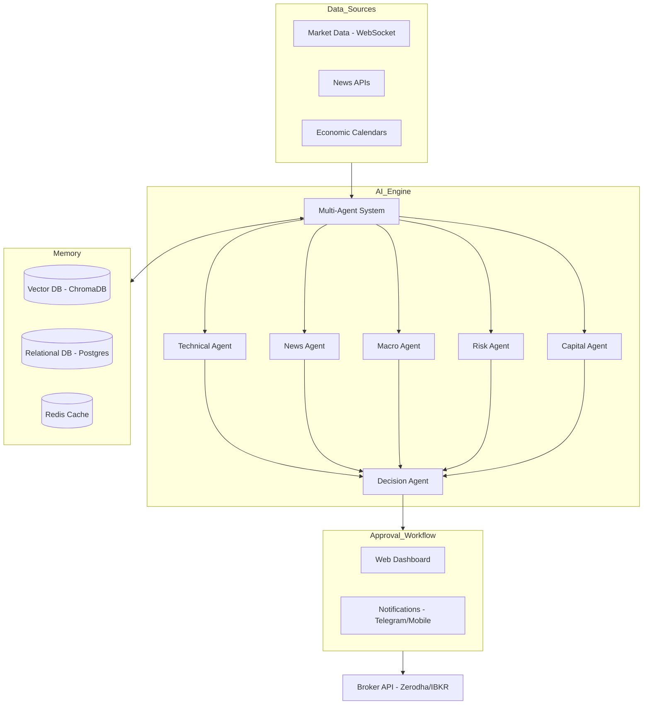

# System Architecture

## Overview

The Enterprise AI Trading Assistant is designed as a distributed system with a focus on modularity and explainability.

## Architecture Diagram

### 1. Data Ingestion Layer
- **Market Data**: Real-time feeds from brokers (Zerodha Kite, Interactive Brokers) via WebSockets.
- **News & Social**: Scraping and API integration (NewsAPI, Twitter/X, Reddit).
- **Macro Data**: Integration with FRED, RBI, and other economic calendars.

### 2. AI Multi-Agent Layer
- **Orchestrator**: Manages the flow of data between agents.
- **RAG (Retrieval-Augmented Generation)**: Uses ChromaDB to store and retrieve historical event context.
- **RL (Reinforcement Learning)**: A continuous loop that updates agent weights based on PnL and user feedback.

### 3. Execution & Approval Workflow
1. **Generation**: Decision Agent proposes a trade.
2. **Validation**: Risk Agent checks against daily limits and margin.
3. **Notification**: User receives an alert (Web/Mobile/Telegram).
4. **Approval**: User reviews the "Why" and hits "Approve".
5. **Execution**: Broker API executes the order.
6. **Monitoring**: System tracks the trade and suggests trailing stops.

### 4. Database Design
- **PostgreSQL**: For transactional data, user profiles, and trade history.
- **ChromaDB**: For vector embeddings of news and market regimes.
- **Redis**: For real-time caching of market prices and session data.
