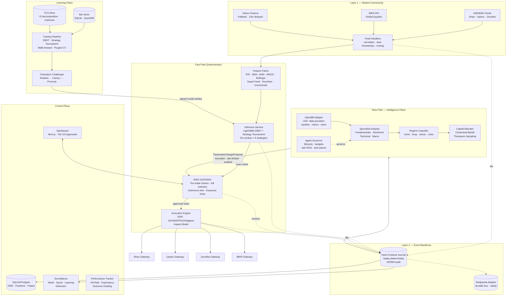

# System Architecture

## Overview

The Multi-Agent Enterprise Trading Bot is built on a **dual-speed architecture** — a deterministic fast path for trade decisions and an LLM-powered slow path for strategic intelligence. Every event flows through a replayable, hash-chained journal, making backtest, shadow trading, and live trading the same code path.

## High-Level Architecture Diagram



## Architecture Layers

### 1. Market Connectivity Layer (Layer 1)

Per-venue feed handlers normalize market data into a unified internal schema:

- **Indian Brokers (Live):** Dhan, Upstox, Zerodha — real SDK integrations with auto-routing
- **Global Brokers:** IBKR adapter built (Phase 4)
- **Fallback:** Yahoo Finance (15-min delayed for NSE/BSE, reliable)
- **Routing:** `pick_provider_for(symbol)` selects optimal source per symbol with 30s cache and data-plan probing

### 2. Event Backbone (Layer 2)

Two-tier event system:

- **Hash-Chained Journal:** Every event content-hashed and chained (`hash(eventₙ)` includes `hash(eventₙ₋₁)`) — tamper-evident, replay-deterministic. Verified by `scripts/verify_audit_chain.py`.
- **Redpanda Adapter:** Kafka-compatible durable bus for persistence, replay, and slow-path consumers. Enabled via `ETB_REDPANDA_BROKERS` env var.
- **In-Memory Bus:** Zero-dependency bus for development and testing.

### 3. Feature & Decision Plane (Layer 3 — Fast Path)

Deterministic, explainable decision-making:

- **Feature Fabric:** Incremental computation of technical indicators (RSI, SMA, EMA, MACD, Bollinger, SuperTrend, Donchian) — O(1)/O(k) updates per tick
- **Inference:** LightGBM GBDT classifiers/regressors per strategy with SHAP-style feature attributions
- **Strategy Tournament:** 55 parameter combinations across 6 strategies, composite-scored with honesty rails
- **Determinism Rule:** No wall-clock, no RNG, no I/O inside the decision function

### 4. Risk & Execution Plane

Security boundary and trade execution:

- **Risk Gateway:** Standalone module, sole credential holder. Pre-trade checks include position limits, exposure caps, fat-finger guards, rate limits, and self-trade prevention
- **Kill Switches:** 4-level escalation (K1: halt strategy → K2: cancel-all → K3: de-risk ladder → K4: drop sessions)
- **Dynamic Autonomy Tiers:** Tier 1 (auto) → Tier 2 (timeout-approval) → Tier 3 (human required)
- **Execution Engine:** Smart Order Router (SOR) + execution algorithms (IS/VWAP/POV/Adaptive) + pre-trade impact model
- **TCA:** Full implementation shortfall decomposition with markout analysis

### 5. Intelligence Plane (Slow Path)

LLM-powered strategic adaptation with multi-source data enrichment:

- **OpenBB Data Adapter:** Optional integration with the [OpenBB SDK](https://openbb.co) for enriched analyst context — equity fundamentals, company profiles, FRED macro indicators, world/company news from 100+ data providers. Graceful degradation if not installed.
- **Specialist Analyst Personas:** 4 domain-specific LLM analysts inspired by [TradingAgents](https://github.com/TauricResearch/TradingAgents) debate patterns:
  - **FundamentalsAnalyst** — earnings, valuation, balance sheet health
  - **SentimentAnalyst** — news flow velocity, narrative shifts, contrarian signals
  - **TechnicalAnalyst** — price action, support/resistance, momentum divergences
  - **MacroAnalyst** — central bank policy, inflation, yield curves, geopolitics
- **Agent Governor:** [Paperclip](https://github.com/paperclipai/paperclip)-inspired lifecycle management — register/pause/resume/terminate agents, per-agent token budget tracking, rate limiting, and automatic pause on error threshold breach.
- **Provider-Agnostic:** 12+ LLM backends (OpenAI, Anthropic, Gemini, Groq, Ollama, etc.)
- **Bounded Output:** Only `ParameterChangeProposal` events — regime labels, strategy weights, risk-limit tightening
- **Direction Asymmetry:** Tightening auto-applies; loosening requires human approval
- **TTL Expiry:** Every parameter change expires back to baseline unless renewed

### 6. Learning Plane

Offline-first learning with safe deployment:

- **Strategy Tournament:** Walk-forward backtesting with purged CV, min-trade gates, fee modeling
- **Contextual Bandit:** Thompson sampling for capital allocation across strategies
- **Champion–Challenger:** Shadow → canary → promotion pipeline with probabilistic Sharpe ratio gates
- **Offline RL:** IQL/CQL research for execution tactics (shadow mode only)

## Data Flow at Runtime

```
Browser → Next.js (pages: dashboard, brokers, training, performance, screener, monitor)
           ↓
           useLivePoll hooks (visibility-aware, abortable, content-hash dedup)
           ↓
           REST → FastAPI backend (app.main:app)
              ↓
              services/* business logic
                  ↓
                  broker_adapters.* (8 adapters: 3 real SDK, 5 sandbox)
                  ↓
                  market_data fallback to Yahoo Finance
              ↓
              SQLAlchemy → SQLite/Postgres (broker_accounts, recommendations, trades, risk_limits)
              ↓
              Event Journal (hash-chained, replay-deterministic)
           ↓
           JSON response
       ↓
       Components re-render (memoised, hash-dedup'd)
```

## Polling Cadences

| Endpoint | Interval | Purpose |
|----------|----------|---------|
| `/health` | once on load | Verify backend up |
| `/market-data/watchlist` | 20s | Live ticker, KPI breadth |
| `/market-data/intraday/{symbol}` | 20s | Chart data |
| `/trades/recommendations` | 60s | Recommendations (30min server cache) |
| `/trades/history` | 60s | Order history |
| `/brokers/accounts` | 60s | Broker badges + capital sum |
| `/risk/limits` | 60s | Kill-switch banner state |
| `/performance/stats` | 120s | Hit-rate header pill |
| `/learning/status` | 2s (training only) | Progress bar |

All polls pause when tab is hidden (`visibilitychange`) and abort in-flight requests before issuing new ones.

## Database Schema

| Table | Purpose |
|-------|---------|
| `users` | User accounts (auth stub) |
| `broker_accounts` | Encrypted broker credentials, connection status, token expiry |
| `trade_recommendations` | AI-generated recommendations with grading fields |
| `trades` | Placed orders with broker details |
| `risk_limits` | Per-user risk gates + kill switch state |
| `market_regimes` | Regime labels from classifier |

## Security Model

- **Credentials:** AES-128-CBC + HMAC encryption (Fernet) at rest
- **Broker Isolation:** Execution router never routes to paper accounts for real orders
- **API Masking:** Raw keys never returned in API responses
- **Risk Gates:** Kill switch < 1s to halt all trading
- **Approval Flow:** Every order requires preview → confirm (LIVE orders get rose-red confirmation)
